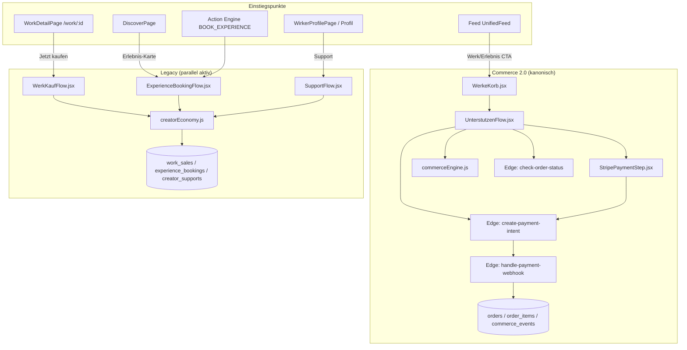

# HUI Commerce Verification — Architektur-Audit (Post Phase 2.3.1)

**Datum:** 2026-07-01  
**Scope:** Reine Verifikation — keine Codeänderungen, kein Refactoring  
**Prüfgrundlage:** Phase 1.1 — genau **ein** offizielles Commerce-System (Commerce 2.0)  
**Commit-Basis:** `a0306fb89d64814d6ae89fe3fdfed1daeb0306e8`

---

## Executive Summary

| Frage | Antwort |
|---|---|
| Sind `WerkKaufFlow` und `ExperienceBookingFlow` Adapter für Commerce 2.0? | **Nein (B)** — sie enthalten **eigene Legacy-Commerce-Logik** |
| Existiert genau ein offizieller Commerce-Flow? | **Nein (B)** — **mehrere konkurrierende Commerce-Systeme** sind aktiv erreichbar |
| Empfehlung | **„Legacy noch vorhanden“** |

Die Dateien `WerkKaufFlow.jsx` und `ExperienceBookingFlow.jsx` sind im Code explizit als `LEGACY — SUPERSEDED BY COMMERCE 2.0` markiert, werden aber nach Phase 2.3.1 **weiterhin aus produktiven Einstiegspunkten aufgerufen**. Zusätzlich existiert `SupportFlow.jsx` als weiterer Legacy-Kauf-/Unterstützungskanal.

---

## Commerce-Architektur — Übersicht



---

## Aufgabe 1 — WerkKaufFlow & ExperienceBookingFlow: Adapter oder Legacy?

### Ergebnis: **B) Eigene Commerce-Logik (Legacy)**

Beide Flows sind **keine Wrapper/Adapter** für Commerce 2.0. Sie:

- importieren **nicht** `commerceEngine.js`, `UnterstutzenFlow`, `WerkeKorb` oder `StripePaymentStep`
- schreiben direkt in **Legacy-Tabellen** via `creatorEconomy.js`
- führen **keine Stripe-Zahlung** durch (`payment_status: "pending"`, Beta-Hinweis „Zahlung wird separat abgewickelt“)
- sind im Datei-Header selbst als Legacy dokumentiert

| Flow | Klassifikation | Begründung (Code) |
|---|---|---|
| `WerkKaufFlow` | **Legacy, vollständig unabhängig** | `salesService.createSale()` → Tabelle `work_sales` |
| `ExperienceBookingFlow` | **Legacy, vollständig unabhängig** | `bookingService.create()` → Tabelle `experience_bookings` |

---

## Aufgabe 2 — Flow-Dokumentation

### 2.1 WerkKaufFlow

| Aspekt | Detail |
|---|---|
| **Datei** | `src/components/commerce/WerkKaufFlow.jsx` |
| **Einstiegspunkt** | `Home.jsx` rendert Overlay wenn `showWerkCheckout !== null` |
| **State-Trigger** | `setShowWerkCheckout(pending)` via Router-State `location.state.pendingWerkKauf` |
| **Routing-Kette** | `/work/:id` → `WorkDetailRouteWrapper` → `navigate("/Home", { state: { pendingWerkKauf: werk } })` → `Home.jsx` useEffect |
| **Komponenten** | Bottom-Sheet-Overlay (inline UI, keine Sub-Flows) |
| **Hooks** | `useAuth()` aus `src/lib/AuthContext` |
| **Contexts** | `AuthContext` (User-ID) |
| **Services** | `salesService` aus `src/services/creatorEconomy.js` |
| **Business-Logik** | Validierung (Login, IDs, kein Selbstkauf) → Preis-Parsing aus Feed-Shapes → `createSale()` → Notification `work_sold` → optional Resonanz via dynamischem Import `useCoreEngine.js` |
| **Zahlungslogik** | **Keine.** Insert mit `payment_status: "pending"`, `payment_provider: "stripe"` (nur Metadatum, kein PI/Webhook) |
| **Stripe** | **Nicht angebunden** |
| **Datenfluss** | UI → `salesService.createSale({ workId, creatorId, buyerId, amount })` → `work_sales` → `notifications.insert` → Success-UI |

**Kernfunktion:**

```41:81:src/components/commerce/WerkKaufFlow.jsx
  async function handleKauf() {
    // ... Validierung ...
    const { data, error } = await salesService.createSale({
      workId, creatorId, buyerId: user.id, amount: amount > 0 ? amount : 0,
    });
    // ... Notification + Resonanz ...
  }
```

---

### 2.2 ExperienceBookingFlow

| Aspekt | Detail |
|---|---|
| **Datei** | `src/components/commerce/ExperienceBookingFlow.jsx` |
| **Einstiegspunkt** | `Home.jsx` rendert Overlay wenn `showBookingFlow !== null` |
| **State-Trigger** | `setShowBookingFlow(item)` aus DiscoverPage, Action Engine, ggf. Profil |
| **Komponenten** | Bottom-Sheet-Overlay (Formular + Success) |
| **Hooks** | `useAuth()` |
| **Contexts** | `AuthContext` |
| **Services** | `bookingService` aus `src/services/creatorEconomy.js` |
| **Business-Logik** | Shape-Normalisierung (Feed vs. Action-Payload) → Validierung → `bookingService.create()` → Notification `booking_request` |
| **Zahlungslogik** | **Keine.** Insert mit `booking_status: "pending"`, `payment_status: "pending"` |
| **Stripe** | **Nicht angebunden** |
| **Datenfluss** | UI → `bookingService.create({ experienceId, creatorId, userId, seats, amount, message })` → `experience_bookings` → `notifications.insert` |

**Kernfunktion:**

```42:77:src/components/commerce/ExperienceBookingFlow.jsx
  async function handleBuchen() {
    // ... Validierung ...
    const { data, error } = await bookingService.create({
      experienceId: expId, creatorId, userId: user.id,
      seats: 1, amount: amount > 0 ? amount : 0, message: message.trim() || "",
    });
    // ... Notification ...
  }
```

---

### 2.3 Commerce 2.0 (Referenz — kanonischer Flow)

| Aspekt | Detail |
|---|---|
| **Einstieg** | `WerkeKorbButton` / Feed-CTA → Cart (`useCartPersistence`) → `WerkeKorb` → `UnterstutzenFlow` |
| **Komponenten** | `WerkeKorb.jsx` → `UnterstutzenFlow.jsx` → `StripePaymentStep.jsx` |
| **Service** | `src/services/commerceEngine.js` (`orderService.buildOrderPayload`, `resolveShippingStrategy`) |
| **Hooks** | `useAuth`, `useCartPersistence` (via `HomeShell`) |
| **Contexts** | `AuthContext`, `HomeShell` (`useHome`) |
| **Stripe** | Client: `@stripe/stripe-js`, `@stripe/react-stripe-js` → `stripe.confirmPayment()` |
| **Server** | `create-payment-intent`, `handle-payment-webhook`, `check-order-status`, `release-payout` |
| **Tabellen** | `orders`, `order_items`, `shipments`, `commerce_events`, `webhook_events` |
| **Datenfluss** | Cart-Items → `buildOrderPayload()` → POST Edge Function → Stripe PI → Zahlung → Webhook → Order `state=paid` → Danke-Screen → Cart leeren |

---

## Aufgabe 3 — Vergleich mit Commerce 2.0

| Kategorie | Commerce 2.0 | WerkKaufFlow | ExperienceBookingFlow |
|---|---|---|---|
| **Cart / Multi-Item** | ✅ WerkeKorb, Multi-Creator | ❌ Single-Werk-Overlay | ❌ Single-Experience-Overlay |
| **Preisvalidierung serverseitig** | ✅ Edge Function + DB Authority | ❌ Nur Client-Parsing | ❌ Nur Client-Parsing |
| **Stripe Payment** | ✅ PI + confirmPayment + Webhook | ❌ Kein Stripe | ❌ Kein Stripe |
| **Order-Modell** | ✅ `orders` / `order_items` / Snapshots | ❌ `work_sales` | ❌ `experience_bookings` |
| **Fulfillment / Payout** | ✅ `fulfillmentService`, `release-payout` | ❌ Nicht vorhanden | ❌ Nicht vorhanden |
| **Impact / Commission** | ✅ `commission_eur`, `impact_eur` kanonisch | ❌ Nicht berechnet | ❌ Nicht berechnet |
| **UI-Pattern** | Bottom-Sheet + Stripe Element | Bottom-Sheet Beta-Anfrage | Bottom-Sheet Beta-Anfrage |
| **Klassifikation** | **Offiziell (Commerce 2.0)** | **Legacy, vollständig unabhängig** | **Legacy, vollständig unabhängig** |

### Identisch

- Overlay-Presentationsmuster (fixed Bottom-Sheet, zIndex ~9999–10100)
- Auth-Guard via `useAuth()`
- Creator-Benachrichtigung via `supabase.from("notifications").insert`
- Preis-Anzeige aus Feed-Item-Shapes (`_raw.price`, `price`)

### Doppelt (parallele Verantwortlichkeiten)

| Verantwortlichkeit | Commerce 2.0 | Legacy |
|---|---|---|
| Werk kaufen | WerkeKorb + Stripe | WerkKaufFlow + work_sales |
| Erlebnis buchen | Cart kann Experiences aufnehmen + Stripe | ExperienceBookingFlow + experience_bookings |
| Creator unterstützen | Cart/Checkout möglich | SupportFlow + creator_supports |

### Nur Adapter

**Keiner** der geprüften Legacy-Flows delegiert an Commerce 2.0.

---

## Aufgabe 4 — Einstiegspunkte (vollständig)

> **Hinweis:** Es existiert **keine** Komponente `ContentDetail` im Repository. Für Werke ist **`WorkDetailPage`** (`/work/:id`) das Detail-Äquivalent. Für Erlebnisse gibt es **keine dedizierte Detail-Route** — Discover/Feed öffnen direkt Booking- oder Cart-Flows.

### Werk

```
Werk (Feed-Karte „Kaufen“)
  → UnifiedFeed.onBook
  → setCart (useCartPersistence)
  → WerkeKorbButton Glow
  → [Commerce 2.0] WerkeKorb → UnterstutzenFlow → Stripe

Werk (Feed-Karte antippen / onDetail)
  → navigate(/work/:id)
  → WorkDetailPage

WorkDetailPage „In den Korb“
  → onAddToKorb — NICHT VERDRAHTET in App.jsx (Button tot)

WorkDetailPage „Jetzt kaufen ✦“
  → onBuyWerk
  → navigate(/Home, { state: { pendingWerkKauf } })
  → [LEGACY] WerkKaufFlow

Discover Werk-Karte
  → navigate(/work/:id)
  → WorkDetailPage (s.o.)
```

**Codepfade:**

- Feed Cart: `src/pages/Home.jsx` L374–381
- Feed Detail: `src/pages/Home.jsx` L383–385 → `src/feed/cards/FeedRouter.jsx` L111
- Work Detail Kauf: `src/App.jsx` L383–385 → `src/pages/Home.jsx` L180–186, L545–549
- Work Detail Korb (tot): `src/components/WorkDetailPage.jsx` L794 — `onAddToKorb` fehlt in `WorkDetailRouteWrapper`

---

### Erlebnis

```
Erlebnis (Feed „Teilnehmen“)
  → UnifiedFeed.onBook
  → setCart
  → [Commerce 2.0] WerkeKorb → UnterstutzenFlow → Stripe

Erlebnis (Discover-Karte)
  → DiscoverPage.handleErlebnisPress
  → onBook → setShowBookingFlow
  → [LEGACY] ExperienceBookingFlow

Erlebnis (Profil /profile/:username — WirkerProfilePage)
  → handleBook → actions[BOOK_EXPERIENCE] (nur innerhalb HomeShell/HuiActionProvider)
  → setShowBookingFlow
  → [LEGACY] ExperienceBookingFlow
  (Außerhalb HomeShell: Action nicht verfügbar, onBook-Prop ist No-Op)

Erlebnis (Profil via ProfileLauncher in Home)
  → TalentProfilePage / BasisProfilePage
  → KEIN Commerce-Einstieg (kein Book/Korb/Support)
```

**Codepfade:**

- Feed: `src/feed/cards/ExperienceContent.jsx` L63–65 → `Home.jsx` L374–381
- Discover: `src/pages/DiscoverPage.jsx` L1633–1636 → `Home.jsx` L421–423, L552–557
- Action Engine: `src/core/hui.actions.js` L275–291
- Profil (Route): `src/pages/wirker-profile/index.jsx` L839–844

---

### Feed

| Aktion | Flow |
|---|---|
| Werk „Kaufen“ | **Commerce 2.0** (Cart) |
| Werk Karte → Detail | `/work/:id` → ggf. **Legacy** bei „Jetzt kaufen“ |
| Erlebnis „Teilnehmen“ | **Commerce 2.0** (Cart) |

---

### Home

| Overlay / State | Flow |
|---|---|
| `showWerkeKorb` | **Commerce 2.0** — WerkeKorb |
| `showUnterstutzenFlow` | **Commerce 2.0** — UnterstutzenFlow + Stripe |
| `showWerkCheckout` | **Legacy** — WerkKaufFlow |
| `showBookingFlow` | **Legacy** — ExperienceBookingFlow |

Rendering: `src/pages/Home.jsx` L500–557  
State-Owner: `src/components/home/HomeShell.jsx` L174–177, L320–323

---

### Discover

| Content-Typ | Aktion | Flow |
|---|---|---|
| Werk | Karten-Tap | `/work/:id` → WorkDetailPage |
| Erlebnis | Karten-Tap | **Legacy** ExperienceBookingFlow |
| Projekt | Karten-Tap | `/impact` (kein Commerce) |
| Person/Moment | Tap | Profil (kein direkter Commerce in ProfileLauncher-Pages) |

---

### Profil

| Profil-Variante | Commerce-Einstieg |
|---|---|
| **ProfileLauncher** (Feed/Discover → `openProfileById`) | TalentProfilePage / BasisProfilePage — **kein Kauf/Buchung** |
| **Route** `/profile/:username` (WirkerProfilePage) | **Legacy** SupportFlow; Book → ExperienceBookingFlow nur mit Action Engine |
| **Creator Dashboard** (Phase 4D Overlay) | Liest Legacy-Tabellen (`bookingService`, `salesService`, `supportService`) |

SupportFlow: `src/pages/wirker-profile/index.jsx` L923–928

---

### Studio

| Pfad | Commerce |
|---|---|
| `/studio`, `/studio/:section` | **Kein Kauf-Flow.** `CreatorStudio.jsx` nutzt `useCreatorBookings` aus `src/lib/bookingContext.js` — separates Legacy-Booking-Intelligence-System (Status-Flow, nicht Commerce 2.0) |
| Studio-Pages unter `src/pages/studio/` | Keine Stripe/Order-Integration gefunden |

---

### Action Engine

| Action | Ziel | Flow |
|---|---|---|
| `BOOK_EXPERIENCE` | `setShowBookingFlow({ experience, creator })` | **Legacy** ExperienceBookingFlow |

Definiert in: `src/core/hui.actions.js` L275–291  
Provider: `src/core/HuiActionProvider.jsx` (nur innerhalb `HomeShell`)

Es existiert **keine** Action `BUY_WORK` — Werk-Kauf aus Detail läuft über Router-State, nicht über die Action Engine.

---

## Aufgabe 5 — Architektur-Bewertung

### Antwort: **B) Mehrere konkurrierende Commerce-Systeme**

#### System 1 — Commerce 2.0 (offiziell, kanonisch)

- **Pfad:** WerkeKorb → UnterstutzenFlow → StripePaymentStep
- **Service:** `commerceEngine.js`
- **Persistenz:** `orders`, `order_items`, Stripe Webhook
- **Erreichbar aus:** Feed (Werk + Erlebnis), WerkeKorb-Button

#### System 2 — Legacy Werk-Verkauf

- **Pfad:** WorkDetail „Jetzt kaufen“ → WerkKaufFlow
- **Service:** `salesService` / `work_sales`
- **Kein Stripe**

#### System 3 — Legacy Erlebnis-Buchung

- **Pfad:** Discover, Action Engine, Profil-Book
- **Service:** `bookingService` / `experience_bookings`
- **Kein Stripe**

#### System 4 — Legacy Direkt-Unterstützung

- **Pfad:** WirkerProfile „Unterstützen“ → SupportFlow
- **Service:** `supportService` / `creator_supports`
- **Kein Stripe** (payment_status pending)

#### System 5 — Legacy Booking Intelligence (Studio/Dashboard)

- **Pfad:** `bookingContext.js`, CreatorDashboard
- **Parallel zu Commerce 2.0**, liest/schreibt Legacy-Booking-Daten

**Fazit:** Commerce 2.0 ist implementiert und für Feed→Cart→Stripe aktiv, aber **nicht exclusiv**. Mindestens **vier clientseitige Kauf-/Buchungskanäle** plus **parallele Backend-Tabellen** sind gleichzeitig in Benutzung.

---

## Aufgabe 6 — Legacy-Inventar (ohne Refactoring)

### WerkKaufFlow

| | |
|---|---|
| **Datei** | `src/components/commerce/WerkKaufFlow.jsx` |
| **Funktion** | `handleKauf()` (L41), Export `WerkKaufFlow` (L23) |
| **Verantwortung** | Single-Werk-Kaufanfrage ohne Zahlung; schreibt `work_sales`; benachrichtigt Creator |
| **Ersetzung** | Item in `cart` legen → `WerkeKorb` → `UnterstutzenFlow` → Stripe; Einstieg `/work/:id` sollte `onAddToKorb` oder direkt Cart befüllen statt `pendingWerkKauf` |

### ExperienceBookingFlow

| | |
|---|---|
| **Datei** | `src/components/commerce/ExperienceBookingFlow.jsx` |
| **Funktion** | `handleBuchen()` (L42), Export `ExperienceBookingFlow` (L15) |
| **Verantwortung** | Erlebnis-Buchungsanfrage ohne Zahlung; schreibt `experience_bookings` |
| **Ersetzung** | Experience als Cart-Item (`type: experience`) → Commerce 2.0 Checkout; Discover `handleErlebnisPress` und `BOOK_EXPERIENCE` auf Cart/Checkout umleiten |

### SupportFlow (zusätzlich gefunden)

| | |
|---|---|
| **Datei** | `src/components/economy/SupportFlow.jsx` |
| **Funktion** | `handleSend()` (L65) |
| **Verantwortung** | Direkte Creator-Unterstützung → `creator_supports`, kein Stripe |
| **Ersetzung** | Support als `type: support` Cart-Item oder dedizierter Commerce-2.0-Support-Order-Typ |

### creatorEconomy Services (Legacy-Backend-Layer)

| Service | Datei | Funktion | Tabelle |
|---|---|---|---|
| `salesService.createSale` | `src/services/creatorEconomy.js` L193 | Werk-Verkauf | `work_sales` |
| `bookingService.create` | `src/services/creatorEconomy.js` L115 | Erlebnis-Buchung | `experience_bookings` |
| `supportService.send` | `src/services/creatorEconomy.js` L55 | Direkt-Support | `creator_supports` |

### Legacy-Einstiegspunkte (Routing/State)

| Datei | Zeilen | Verantwortung |
|---|---|---|
| `src/App.jsx` | L383–385 | `onBuyWerk` → Router-State → WerkKaufFlow |
| `src/pages/Home.jsx` | L180–186, L545–549 | `pendingWerkKauf` → WerkKaufFlow |
| `src/pages/Home.jsx` | L421–423, L552–557 | Discover → ExperienceBookingFlow |
| `src/core/hui.actions.js` | L275–291 | `BOOK_EXPERIENCE` → ExperienceBookingFlow |
| `src/pages/wirker-profile/index.jsx` | L923–928 | SupportFlow Overlay |

---

## Vollständiger Commerce-Datenfluss

### Commerce 2.0 (Happy Path)

```
1. User tippt „Kaufen“ / „Teilnehmen“ im Feed
   └─ Home.jsx: setCart([...items])                    [localStorage via useCartPersistence]

2. User öffnet WerkeKorb → „Unterstützen“
   └─ WerkeKorb.jsx: onUnterstuetzen(enrichedItems)
   └─ Home.jsx: setShowUnterstutzenFlow(true)

3. UnterstutzenFlow mount
   └─ useEffect: createPaymentIntent()
       ├─ resolveShippingStrategy(items)               [commerceEngine.js]
       ├─ orderService.buildOrderPayload(...)          [commerceEngine.js]
       ├─ POST /functions/v1/create-payment-intent     [Supabase Edge]
       │    └─ Server: Auth, Preis aus DB, Order+Items anlegen (pending)
       └─ setClientSecret, setOrderId

4. StripePaymentStep
   └─ loadStripe(publishableKey)
   └─ elements.submit() + stripe.confirmPayment()
       └─ redirect: /?hui_order={orderId}&status=success (bei Redirect-PMs)

5. Webhook (serverseitig)
   └─ handle-payment-webhook
       └─ Order state → paid, payment_confirmed_at, commerce_events

6. Erfolg UI
   └─ UnterstutzenFlow: handleStripeSuccess → DankeScreen
   └─ clearCartAfterSuccess(setCart) + clearCartPersist()
```

### Legacy WerkKaufFlow

```
WorkDetailPage „Jetzt kaufen“
  → App.jsx navigate(/Home, { pendingWerkKauf })
  → Home.jsx setShowWerkCheckout
  → WerkKaufFlow.handleKauf()
  → salesService.createSale() → work_sales (payment_status: pending)
  → notifications.insert(type: work_sold)
  → optional resonanceHelpers.onWorkPurchased()
```

### Legacy ExperienceBookingFlow

```
Discover / BOOK_EXPERIENCE
  → setShowBookingFlow(payload)
  → ExperienceBookingFlow.handleBuchen()
  → bookingService.create() → experience_bookings (pending)
  → notifications.insert(type: booking_request)
```

---

## Adapter vs. Legacy — Matrix

| Komponente | Status | Stripe | commerceEngine | Legacy-DB |
|---|---|---|---|---|
| WerkeKorb | Commerce 2.0 UI | — | indirekt (Utils) | — |
| UnterstutzenFlow | Commerce 2.0 | ✅ | ✅ | — |
| StripePaymentStep | Commerce 2.0 | ✅ | ✅ (Appearance) | — |
| commerceEngine.js | Commerce 2.0 Service | — | — | orders/order_items |
| WerkKaufFlow | **Legacy** | ❌ | ❌ | work_sales |
| ExperienceBookingFlow | **Legacy** | ❌ | ❌ | experience_bookings |
| SupportFlow | **Legacy** | ❌ | ❌ | creator_supports |
| creatorEconomy.js | **Legacy Service Layer** | ❌ | ❌ | 3 Legacy-Tabellen |

---

## Risiken

| Risiko | Schwere | Beschreibung |
|---|---|---|
| **Split-Brain Commerce** | 🔴 Kritisch | Gleiche User-Aktion (Werk kaufen / Erlebnis buchen) landet in unterschiedlichen Tabellen und Prozessen je nach Einstiegspunkt |
| **Keine Zahlung in Legacy-Flows** | 🔴 Kritisch | Legacy-Flows erzeugen `pending`-Records ohne Stripe — Creators sehen Anfragen, Zahlungsfluss fehlt |
| **WorkDetail „In den Korb“ tot** | 🟠 Hoch | `onAddToKorb` in `WorkDetailRouteWrapper` nicht übergeben — Commerce-2.0-Pfad aus Detailseite blockiert |
| **Discover vs. Feed Divergenz** | 🟠 Hoch | Feed-Erlebnis → Commerce 2.0 Cart; Discover-Erlebnis → Legacy Booking |
| **Profil-Doppelarchitektur** | 🟡 Mittel | ProfileLauncher (kein Commerce) vs. WirkerProfileRoute (Legacy Support/Book) |
| **CreatorDashboard auf Legacy-Daten** | 🟡 Mittel | Dashboard aggregiert `work_sales`, `experience_bookings`, `creator_supports` — nicht `orders` |
| **Edge Functions Runtime** | 🟡 Mittel | `supabase/COMMERCE_RUNTIME_STATUS.md` dokumentiert historische 503-Fehler — Commerce 2.0 abhängig von deployter Infrastruktur |
| **Inkonsistente Dokumentation** | 🔵 Niedrig | `docs/ARCHITECTURE_INDEX.md` listet WerkKaufFlow als Commerce-Logik ohne Legacy-Hinweis |

---

## Eindeutige Empfehlung

### **„Legacy noch vorhanden“**

Phase 1.1 (**genau ein offizielles Commerce-System — Commerce 2.0**) wird **nicht** vollständig eingehalten.

**Nachweis:**

1. `WerkKaufFlow.jsx` und `ExperienceBookingFlow.jsx` sind **keine Adapter** — sie implementieren eigenständige Legacy-Logik mit eigenen DB-Tabellen.
2. Beide Flows sind ** aktiv verdrahtet** in `Home.jsx` (L545–557).
3. WorkDetail-Route leitet **explizit** auf WerkKaufFlow (`App.jsx` L383–385).
4. Discover und Action Engine leiten **explizit** auf ExperienceBookingFlow.
5. Zusätzlich: `SupportFlow` als weiterer Legacy-Commerce-Kanal auf Profil-Routen.

**Commerce 2.0 ist vorhanden und funktional verdrahtet** (Feed → Cart → Stripe), aber ** nicht der einzige erreichbare Commerce-Pfad**.

---

## Definition of Done — Checkliste

| Kriterium | Status |
|---|---|
| WerkKaufFlow analysiert | ✅ |
| ExperienceBookingFlow analysiert | ✅ |
| Alle Einstiegspunkte geprüft | ✅ |
| Commerce-Datenfluss dokumentiert | ✅ |
| Adapter oder Legacy eindeutig bewertet | ✅ (beide = **Legacy B**) |
| Keine Codeänderungen | ✅ |
| Build unverändert | ✅ |
| Dokumentation vollständig | ✅ |

---

## Anhang — Relevante Dateien

| Rolle | Pfad |
|---|---|
| Legacy Werk-Kauf | `src/components/commerce/WerkKaufFlow.jsx` |
| Legacy Erlebnis-Buchung | `src/components/commerce/ExperienceBookingFlow.jsx` |
| Legacy Support | `src/components/economy/SupportFlow.jsx` |
| Legacy Services | `src/services/creatorEconomy.js` |
| Commerce 2.0 Engine | `src/services/commerceEngine.js` |
| Commerce 2.0 UI | `src/components/commerce/WerkeKorb.jsx`, `UnterstutzenFlow.jsx`, `StripePaymentStep.jsx` |
| Orchestrator | `src/pages/Home.jsx`, `src/components/home/HomeShell.jsx` |
| Routing | `src/App.jsx`, `src/routes/registry.js` |
| Action Engine | `src/core/hui.actions.js`, `src/core/HuiActionProvider.jsx` |
| Edge Functions | `supabase/functions/create-payment-intent/`, `handle-payment-webhook/`, `check-order-status/` |
| Cart Persistence | `src/hooks/useCartPersistence.js` |

---

*Audit durchgeführt ohne Repository-Modifikationen am Anwendungscode. Nur diese Verifikationsdatei wurde erstellt.*
