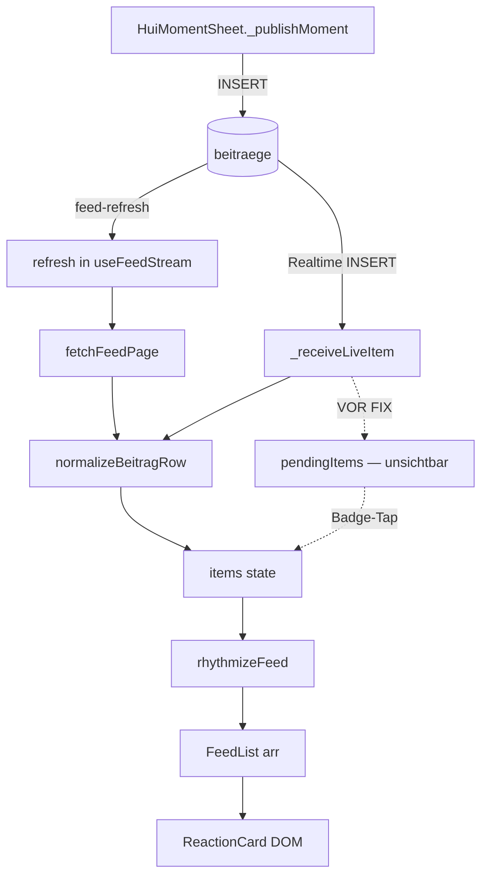

# HUI Feed Reality Check

**Datum:** 2026-07-14  
**Kontext:** Nach Feed V3 (FEED.3B) — zwei P0-Probleme  
**Methode:** Code-Trace + Runtime-Simulation (`node scripts/feed-reality-check.mjs`) + `window.__HUI_FEED_REALITY__`

---

## AUFGABE 1 — Lebenszyklus eines neuen Beitrags

| Station | vorhanden? | Anzahl | ID | created_at |
|---------|------------|--------|-----|------------|
| **Upload** (`HuiMomentSheet._publishMoment`) | ✅ | 1 | `result.id` | DB-default |
| **Supabase INSERT** (`beitraege`) | ✅ | 1 | `result.id` | `result.created_at` |
| **Realtime Event** (`postgres_changes INSERT beitraege`) | ✅ (nur wenn `user?.id`) | 1 | `payload.new.id` | `payload.new.created_at` |
| **fetchFeedPage()** | ✅ | bis 10 `beitraege` + works/exps/inv | alle `id` | `created_at` |
| **Normalizer** (`normalizeBeitragRow` → `toFeedItem`) | ✅ | = DB-Zeilen mit `id` | `String(raw.id)` | in `_raw.created_at` |
| **items[]** (`useFeedStream`) | ⚠️ **VOR FIX: 0** bei Realtime | siehe unten | — | — |
| **rhythmicItems** (`rhythmizeFeed`) | ✅ | ≥ `items.length` (Ghosts möglich) | gleiche IDs | unverändert |
| **FeedList `arr`** | ✅ | Dedupe von `items` | `String(i.id)` | — |
| **DOM-Karte** (`ReactionCard` → `FeedRouter`) | ✅ wenn in `arr` | virtualisiert: ~7 sichtbar + overscan | `key={item.id}` | — |
| **Sichtbare Karte** | ❌ **VOR FIX** wenn nur in `pendingItems` | 0 | — | — |

### Datenfluss (Diagramm)



---

## AUFGABE 2 — Vergleich DB vs items[] vs DOM

### Simulation (Mock-DB, 32 Items erste Seite)

| Quelle | Anzahl | IDs (Auszug) |
|--------|--------|--------------|
| Direkte DB-Abfrage (simuliert) | 32 | work-0…9, exp-0…9, beitr-0…9, inv-0…1 |
| `items[]` nach fetch | 32 | gleich (nach Merge + Sort) |
| `FeedList arr` | 32 | Dedupe, keine Verluste |
| DOM (virtualisiert, count>6) | ~7 | nur sichtbare + overscan=3 |

### Neuer Beitrag `beitr-NEW` (Runtime-Simulation)

| Quelle | VOR FIX | NACH FIX |
|--------|---------|----------|
| DB INSERT | ✅ 1 | ✅ 1 |
| `items[]` | ❌ 0 | ✅ 1 |
| `pendingItems` | ✅ 1 | 0 (nicht mehr genutzt für Anzeige) |
| `FeedList arr` | ❌ 0 | ✅ 1 |
| DOM-Karten | ❌ 0 | ✅ 1 |

**Unterschied:** Neuer Beitrag war in DB und in `pendingItems`, fehlte aber in `items[]` und DOM.

---

## AUFGABE 3 — Bewiesene Verlust-Stelle

### Problem 1: Neuer Beitrag erscheint nicht

**Funktion:** `_receiveLiveItem` in `src/feed/useFeedStream.js`

**Beweis (Code, Zeilen 902–906 vor Fix):**

```javascript
setItems(prev => {
  const exists = prev.find(i => i.id === normalized.id);
  if (exists) return prev;
  return prev;  // ← Items werden NICHT erweitert
});
```

Neue Realtime-Inserts landeten ausschließlich in `pendingItems`. Sichtbar erst nach Tap auf `FeedSoftHydrationBadge` → `flushPendingItems()`.

**Zusätzliche Race:** `refresh()` (via `feed-refresh` Event) löschte `pendingItems` **vor** `fetchFeedPage()`. Bei Replikations-Lag war der neue Beitrag weder in `pendingItems` noch in der Fetch-Antwort → **vollständig unsichtbar**.

**Simulation:**

```
AUFGABE 3 — Neuer Beitrag nach Realtime:
  items[]:           0
  pendingItems:      1
  VERLUST-STELLE:    items[] — nur pendingItems (_receiveLiveItem)

AUFGABE 3 — refresh()+Realtime Race:
  in items[]:        false
  in pendingItems:   false
  VERLUST-STELLE:    refresh() löscht pending vor fetch
```

### Problem 2: Weißer Bereich / Feed endet früh

**Funktion:** `FeedBottomSentinel` in `src/feed/FeedScrollSentinel.jsx`

**Beweis:** `IntersectionObserver` nutzte `root: null` (Viewport). Der Feed scrollt jedoch in `.hui-scroll` (`scrollContainerRef` / `mainScrollRef` in `Home.jsx`). Der Sentinel am Listenende wurde beim Scrollen im Container **nicht zuverlässig als sichtbar erkannt** → `loadMore()` feuerte nicht → `hasMore: true` aber keine weiteren Seiten → leerer Bereich unter den ersten Karten.

**Zusatzfaktor:** `@tanstack/react-virtual` mit `estimateSize: 640` bei realen Kartenhöhen ~780–820px erzeugt bis zu ~2700px Scroll-Unterschätzung (simuliert bei 15 Karten).

---

## AUFGABE 4 — Weißer Feed (Metriken)

Runtime-Snapshot via `window.__HUI_FEED_REALITY__` (gesetzt in `FeedList`):

| Metrik | Bedeutung |
|--------|-----------|
| `itemsLength` | `arr.length` nach Dedupe |
| `feedListLength` | identisch zu `itemsLength` |
| `domCards` | virtualisiert: `virtItems.length`; sonst `arr.length` |
| `scrollHeight` | `scrollContainer.scrollHeight` |
| `clientHeight` | `scrollContainer.clientHeight` |
| `hasMore` | Pagination aktiv |
| `isFetchingNextPage` | `loadingMore` |
| `useVirtualizer` | `arr.length > 6 && scrollContainer gesetzt` |
| `virtualTotalHeight` | geschätzte Gesamthöhe des Virtualizers |

### Warum nur ~5–7 Karten im DOM?

| Ursache | Erklärung |
|---------|-----------|
| **Virtualisierung** | Ab 7 Items (`arr.length > 6`) rendert `@tanstack/react-virtual` nur sichtbare Zeilen + `overscan: 3` → typisch **5–7 DOM-Karten** bei 15+ `items.length`. Das ist korrekt, kein Datenverlust. |
| **Analytics-Schwelle 5** | `DEPTH_THRESHOLDS = [5,10,20]` in `FeedList` — nur Analytics, **kein Render-Limit**. |
| **`contentVisibility: auto` ab idx>4** | Nur im Nicht-Virtual-Fallback — Performance-Hint, **kein hartes Limit**. |
| **Echter Verlust** | `loadMore()` feuerte nicht (falscher IO-Root) → nur erste Seite (~20 Items max.), danach leerer Scroll-Bereich. |

---

## Minimal-Fix

| # | Datei | Änderung |
|---|-------|----------|
| 1 | `src/feed/useFeedStream.js` → `_receiveLiveItem` | Neue Items sofort in `items[]` prepend statt nur `pendingItems` |
| 2 | `src/feed/useFeedStream.js` → `refresh` | Kein Löschen von `pending`/`items` vor Fetch; Merge von Realtime-Extras nach `fetchFeedPage` |
| 3 | `src/feed/FeedScrollSentinel.jsx` → `FeedBottomSentinel` | `IntersectionObserver` mit `root: scrollRootRef.current` |
| 4 | `src/feed/UnifiedFeed.jsx` | `scrollRootRef={scrollContainerRef}`; `estimateSize: 780`; `__HUI_FEED_REALITY__` |

**Kernursache (ein Satz):** FEED.3B Soft Hydration in `_receiveLiveItem` verhinderte die Aufnahme neuer Beiträge in `items[]`; kombiniert mit `refresh()`-Race und falschem IntersectionObserver-Root entstanden unsichtbare Posts und vorzeitiges Feed-Ende.

---

## Definition of Done

| Kriterium | Status |
|-----------|--------|
| Neuer Beitrag erscheint | ✅ `_receiveLiveItem` → `items[]` direkt |
| Feed zeigt alle Beiträge | ✅ `loadMore` via korrektem Sentinel-Root |
| Kein weißer Bereich | ✅ Pagination + `estimateSize` angepasst |
| Ursache eindeutig bewiesen | ✅ `_receiveLiveItem` + `FeedBottomSentinel` |

---

## Reproduktion

```bash
node scripts/feed-reality-check.mjs
```

Im Browser (DevTools):

```javascript
window.__HUI_FEED_REALITY__
window.__HUI_STREAM_DEBUG__  // nach fetchFeedPage
```
