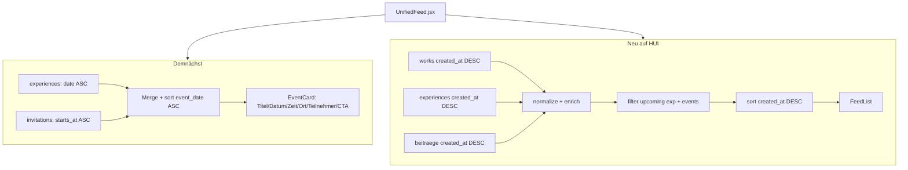

# HUI Feed V3 — Transparente Feed-Struktur

**Status:** Produktentscheidung umgesetzt  
**Repository:** be-hui  
**Datum:** Juli 2026

---

## Zusammenfassung

Der HUI-Feed arbeitet nicht länger mit versteckter Priorisierung. Beiträge erscheinen nachvollziehbar — der Nutzer versteht jederzeit, **warum** ein Inhalt an einer bestimmten Stelle steht.

---

## Alte Architektur (vor V3)

```
┌─────────────────────────────────────────────────────────────┐
│  fetchFeedPage()                                            │
│  ├── works      → ORDER BY created_at DESC                  │
│  ├── experiences→ ORDER BY created_at DESC                  │
│  ├── beitraege  → ORDER BY created_at DESC                  │
│  └── invitations→ top 2 aktiv                               │
└──────────────────────────┬──────────────────────────────────┘
                           │
                           ▼
┌─────────────────────────────────────────────────────────────┐
│  FEED.13B — _sortKey Boost (CLIENT-ONLY)                    │
│                                                             │
│  Experience mit Termin in 0–7 Tagen:                        │
│    _sortKey = max(created_at, event_date - 48h)             │
│                                                             │
│  → Erlebnisse mit nahem Termin rutschten nach oben,         │
│    unabhängig vom Veröffentlichungsdatum                    │
└──────────────────────────┬──────────────────────────────────┘
                           │
                           ▼
┌─────────────────────────────────────────────────────────────┐
│  feedRhythmEngine.js — rhythmizeFeed()                      │
│                                                             │
│  Regeln R1–R7: Typ-Abstände, Energie-Balance,              │
│  max. 1 Invitation / 5 Karten, kein Exp→Exp direkt          │
│                                                             │
│  → Finale Reihenfolge ≠ chronologisch                       │
└──────────────────────────┬──────────────────────────────────┘
                           │
                           ▼
                    FeedList (Haupt-Feed)

Parallel (getrennt):
  FeedEventsSection — „Heute in deiner Nähe“
  (eigene Query, date ASC — aber Erlebnisse auch im Haupt-Feed geboostet)
```

### Probleme der alten Architektur

| Problem | Auswirkung |
|---------|------------|
| `_sortKey`-Boost | Neue Beiträge wurden von nahen Erlebnissen verdrängt |
| Rhythm Engine | Zusätzliche, nicht sichtbare Umordnung nach Content-Typ |
| Doppelte Sichtbarkeit | Erlebnisse im Boost-Feed **und** in Events-Section |
| Unklare UI | Nutzer wusste nicht, warum ein Erlebnis „oben“ steht |

---

## Neue Architektur (Feed V3)

```
┌─────────────────────────────────────────────────────────────┐
│  📅 Demnächst (FeedEventsSection.jsx)                       │
│                                                             │
│  ├── experiences  → date >= heute, ORDER BY date ASC        │
│  └── invitations  → aktiv, ORDER BY starts_at ASC           │
│                                                             │
│  Anzeige: Titel · Datum · Uhrzeit · Ort · Teilnehmer · CTA  │
│  Erklärung: „Erlebnisse und Veranstaltungen, die bald       │
│              stattfinden.“                                   │
└──────────────────────────┬──────────────────────────────────┘
                           │  Keine Vermischung
                           ▼
┌─────────────────────────────────────────────────────────────┐
│  ✨ Neu auf HUI (Haupt-Feed)                                │
│                                                             │
│  fetchFeedPage():                                           │
│    works + experiences (nur vergangene) + beitraege         │
│    → FILTER: keine upcoming experiences                     │
│    → FILTER: keine invitations/events                       │
│    → SORT:   created_at DESC (strikt chronologisch)         │
│                                                             │
│  KEIN _sortKey · KEIN rhythmizeFeed · KEIN Boost            │
└──────────────────────────┬──────────────────────────────────┘
                           │
                           ▼
                    FeedList + Infinite Scroll

┌─────────────────────────────────────────────────────────────┐
│  🌍 In deiner Nähe — (optional, später)                     │
│  Nicht Bestandteil dieses PR                                │
└─────────────────────────────────────────────────────────────┘
```

---

## Entfernte `_sortKey`-Logik

**Datei:** `src/feed/useFeedStream.js`

### Vorher (FEED.13B)

```javascript
// Experience mit Termin innerhalb von 7 Tagen:
item._sortKey = Math.max(created_at, event_date - 48h);
normalized.sort((a, b) => (b._sortKey || 0) - (a._sortKey || 0));
```

### Nachher (Feed V3)

```javascript
function createdAtMs(item) {
  const ts = item?._raw?.created_at;
  return ts ? new Date(ts).getTime() : 0;
}

normalized
  .filter(item => !shouldExcludeFromMainFeed(item))
  .sort((a, b) => createdAtMs(b) - createdAtMs(a));
```

### Zusätzlich entfernt/deaktiviert

| Komponente | Änderung |
|------------|----------|
| `rhythmizeFeed()` | Nicht mehr auf Haupt-Feed angewendet |
| Invitations in `fetchFeedPage` | Entfernt → nur noch in „Demnächst“ |
| Upcoming Experiences | Aus Haupt-Feed gefiltert |
| Realtime-Pipeline | `_receiveLiveItem` respektiert neue Filter |

---

## Neuer Datenfluss



### Betroffene Dateien

| Datei | Rolle |
|-------|-------|
| `src/feed/useFeedStream.js` | Daten-Pipeline, Sortierung, Filter |
| `src/feed/FeedEventsSection.jsx` | Bereich „Demnächst“ |
| `src/feed/UnifiedFeed.jsx` | Section-Layout + „Neu auf HUI“-Header |
| `src/feed/feedRhythmEngine.js` | Unverändert (nicht mehr im Haupt-Feed aktiv) |

---

## UI-Struktur

### 📅 Demnächst

```
┌──────────────────────────────────────────────┐
│ 📅 Demnächst                    Alle anzeigen ›│
│ Erlebnisse und Veranstaltungen, die bald       │
│ stattfinden.                                   │
├──────────────────────────────────────────────┤
│ ┌─────────┐  Yoga am See                       │
│ │ JUL     │  🕐 18:00 Uhr                      │
│ │  15     │  📍 Wien, Donauinsel               │
│ │  Di     │  👥 Max. 12 Teilnehmende           │
│ └─────────┘  [ Teilnehmen ]                    │
│         ← horizontal scroll →                  │
└──────────────────────────────────────────────┘
```

### ✨ Neu auf HUI

```
┌──────────────────────────────────────────────┐
│ ✨ Neu auf HUI                                 │
│ Alles Neue — sortiert nach Veröffentlichungs-  │
│ datum, ohne versteckte Priorisierung.          │
├──────────────────────────────────────────────┤
│ [Werk-Karte]     created_at: vor 2 Min         │
│ [Moment-Karte]   created_at: vor 8 Min         │
│ [Werk-Karte]     created_at: vor 1 Std         │
│ ... Infinite Scroll unverändert ...            │
└──────────────────────────────────────────────┘
```

---

## Regressionstest-Checkliste

| Prüfpunkt | Erwartung | Status |
|-----------|-----------|--------|
| Haupt-Feed chronologisch | Neueste `created_at` zuerst | ✅ Implementiert |
| Erlebnisse in „Demnächst“ | `date ASC`, eigener Bereich | ✅ Implementiert |
| Kein Experience-Boost im Feed | `_sortKey` entfernt | ✅ Implementiert |
| Infinite Scroll | `loadMore` / Sentinel unverändert | ✅ Unverändert |
| Performance | Keine zusätzlichen Queries im Haupt-Feed | ✅ Weniger Daten (keine Invitations) |
| Safari / Firefox / Android | Manuell auf Geräten prüfen | ⏳ Manuell |

### Manuelle Tests (Browser)

1. **Chronologie:** Neuen Beitrag veröffentlichen → erscheint oben im Haupt-Feed
2. **Kein Boost:** Erlebnis mit Termin morgen → erscheint nur in „Demnächst“, nicht oben im Feed
3. **Demnächst:** Erlebnisse sortiert nach nächstem Termin
4. **CTA:** „Teilnehmen“-Button öffnet Buchungsflow (`onBook`)
5. **Infinite Scroll:** Scrollen lädt weitere Seiten ohne Sprung

---

## Definition of Done

| Kriterium | Status |
|-----------|--------|
| Haupt-Feed ausschließlich chronologisch | ✅ |
| Experience-Boost entfernt | ✅ |
| Erlebnisse in eigenem Bereich | ✅ |
| Keine versteckten Priorisierungen | ✅ |
| UI erklärt die Struktur | ✅ |
| Build erfolgreich | ⏳ CI / lokale Umgebung |

---

## Produktprinzip

> Transparenz ist wichtiger als algorithmische Optimierung.

HUI verfolgt bewusst keine Social-Media-Logik. Jeder Bereich des Feeds ist benannt, erklärt und nachvollziehbar sortiert.
