# HUI Performance Baseline Audit

**Sprint 12 — Phase 1 (Analyse only)**  
**Stand:** 2026-07-16  
**Methode:** Statische Code-Analyse + Messwerte aus vorhandenen Build-Artefakten (`www/assets/`)  
**Kein Build, kein Code-Change, kein Commit, keine PR in diesem Sprint**

---

## Hinweis zu Grundlagendokumenten

Die im Sprint-Auftrag genannten Dateien sind im Repository **nicht vorhanden**:

| Erwartet | Status |
|----------|--------|
| `HUI_ARCHITECTURE_MASTER_PLAN.md` | nicht gefunden |
| `HUI_ENGINEERING_STANDARDS.md` | nicht gefunden |
| `HUI_PERFORMANCE_FRAMEWORK.md` | nicht gefunden |

Verwendete Referenzen für diesen Audit:

- `HUI_CONSTITUTION.md`, `CODEBASE.md`, `QUERY_RULES.md`
- `docs/PERFORMANCE_REPORT.md` (Phase 4D, Stand 2026-05-17)
- `docs/REALTIME_REGISTRY.md` (Phase 4A.4, Stand 2026-05-17)
- `vite.config.js`, `package.json`
- `src/` — 266 JS/JSX-Dateien, **94.509 Zeilen** gesamt

---

## Executive Summary

| Bereich | Messwert / Befund | Schweregrad |
|---------|------------------|-------------|
| **Bundle (JS)** | 2.869.828 Bytes (~2,74 MB) in 66 Chunks; Vendor 33,6 % | Mittel |
| **Größter Chunk** | `vendor-B2A-RkCI.js` — 802.655 Bytes | Hoch |
| **Größte Seiten-Chunks** | `Home` 401 KB, `index` 242 KB, `ImpactPage` 85 KB | Hoch |
| **React Contexts** | 16 definiert, 14 aktiv gemountet, max. 14 Ebenen Tiefe | Mittel |
| **Komponenten >500 Zeilen** | 55 Dateien; größte: `ImpactPage.jsx` (3.399 Z.) | Hoch |
| **Feed-Rendering** | Keine Virtualisierung; alle Items per `map()`; Cap 200 Items | Hoch |
| **Realtime** | 22 `supabase.channel()`-Aufrufe; 6 Tabellen mit parallelen Kanälen | Mittel |
| **Timer / Polling** | 16 `setInterval`, 6 DB-Polling-Loops | Mittel |
| **Supabase** | 471 DB-Queries; **89** SELECT ohne Limit/Range/Single | Hoch |
| **Speicher** | Feed-Cap 200, LiveTicker-Buffer 30, `_queryCache` Map (unbounded keys) | Mittel |
| **Bilder** | `loading="lazy"` weit verbreitet; `useImageLazyLoad` nicht implementiert | Niedrig |
| **Ungenutzte Deps** | `@tanstack/react-virtual` in `package.json`, 0 Imports in `src/` | Mittel |

**Kernbefund:** Die App nutzt Lazy-Loading und Tab-Keep-Alive aggressiv (alle Haupttabs bleiben gemountet), kombiniert mit großen Monolith-Seiten und fehlender Listen-Virtualisierung. Bundle-Größe und Runtime-Kosten konzentrieren sich auf `Home`, `vendor` und die vier Keep-Alive-Tabs.

**Nicht messbar ohne Runtime-Profiling:** tatsächliche Re-Render-Häufigkeit, FPS, LCP/INP, Heap-Snapshots. Diese Felder sind als *strukturelle Risiken* dokumentiert, nicht als Messwerte.

---

## 1. Bundle

**Quelle:** Vorhandene Build-Artefakte in `www/assets/` (Vite `outDir: "www"`, `vite.config.js`). Kein neuer Build in diesem Sprint.

### Gesamtgröße

| Metrik | Wert |
|--------|------|
| `www/assets/` gesamt | 3,0 MB |
| JS + CSS Chunks | 2,9 MB |
| JS allein | 2.868.828 Bytes |
| CSS (`index-D6bf86Ih.css`) | 16.367 Bytes |

### Vendor-Anteil

| Kategorie | Bytes | Anteil |
|-----------|------:|-------:|
| Vendor-Chunks (`vendor`, `react-vendor`, `supabase-vendor`, `stripe-vendor`) | 964.733 | **33,6 %** |
| App-Chunks (alle übrigen) | 1.904.095 | 66,4 % |

| Vendor-Chunk | Bytes |
|--------------|------:|
| `vendor-B2A-RkCI.js` | 802.655 |
| `react-vendor-Db8AeWW8.js` | 159.830 |
| `stripe-vendor-BzddkrCy.js` | 2.247 |
| `supabase-vendor-l0sNRNKZ.js` | 1 |

`supabase-vendor` (1 Byte) deutet auf Externalisierung/Dedup in den Haupt-Chunks hin — Supabase-Code liegt primär in App-Chunks, nicht isoliert.

### Größte Chunks (Top 15)

| Bytes | Datei | Typ |
|------:|-------|-----|
| 802.655 | `vendor-B2A-RkCI.js` | Vendor |
| 401.428 | `Home-Bd_vEl1K.js` | Route (Eager-Shell + viele Imports) |
| 242.465 | `index-DVpDHDuM.js` | Entry |
| 159.830 | `react-vendor-Db8AeWW8.js` | Vendor |
| 84.892 | `ImpactPage-DKZJAs_K.js` | Lazy Route |
| 80.313 | `MyBasisProfile-D9XzroaX.js` | Lazy (Profile) |
| 74.684 | `DiscoverPage-D3deECu2.js` | Lazy Tab |
| 71.603 | `OrbSignatur-I8nGeWRa.js` | Lazy |
| 55.552 | `ImpactFlow-DLBRUJjm.js` | Lazy Flow |
| 46.742 | `TalentProfilePage-D8p6hJLn.js` | Lazy |
| 44.738 | `HuiCreateFlow-CML7XRBH.js` | Lazy |
| 40.503 | `HuiStudio-DatTxHUH.js` | Lazy |
| 38.346 | `Admin-kRgCehZY.js` | Lazy Route |
| 37.288 | `MeineProjekteModal-BsXx0vAm.js` | Lazy Modal |
| 32.358 | `AmbassadorStudioSection-fsuiIDe0.js` | Lazy |

**Summe Top-5 App-Chunks (ohne vendor):** 1.199.882 Bytes (~42 % des gesamten JS).

### Lazy-Chunks

| Metrik | Wert |
|--------|------|
| Lazy-Chunk-Dateien in `www/assets/` | 64 (alle außer `index-*` Entry) |
| `React.lazy` / `lazy()` in `src/` | **62** Aufrufe |
| Dynamische `import()` in `src/` | **73** Aufrufe |

**Lazy-Entry-Points (`App.jsx`):** `Home`, `RefRedirect`, `ImpactPage`, `Admin`, `DiagnosePage`, `PlatformDashboard`, `CreatorStudio`, `WirkerProfilePage`, `WorkDetailPage`

**Lazy Tab/Overlay (`Home.jsx`):** `DiscoverPage`, `ImpactPage`, `FavoritesPage`, `TeilenFlow`, `WorkFlow`, `ExperienceFlow`, `ImpactFlow`, `LiveMapPage`, `HuiMatchOverlay`, `HuiMembershipFlow`, `CreatorDashboard`, `HuiCreateFlow`, `StoryComposer`

**Eager in `Home.jsx` (nicht lazy):** `UnifiedFeed`, `ChatCenterOverlay`, `ProfileLauncher`, `MeinHUI`, Commerce-Flows (`WerkeKorb`, `WerkKaufFlow`, …), `HuiLiveTicker`

### Dynamic Imports (produktiv)

| Datei | Anzahl `import()` | Beispiel |
|-------|------------------:|----------|
| `MyBasisProfile.jsx` | 18 | Studio-Modals, Wizards |
| `Home.jsx` | 13 | Tab-Pages, Flows |
| `App.jsx` | 9 | Top-Level Routes |
| `DiscoverPage.jsx` | 6 | `*AllModal` |
| `FeedRouter.jsx` | 6 | Card-Content-Typen |
| `StatistikenModal.jsx` | 1 | `jspdf` (on-demand PDF) |
| `main.jsx` | 1 | `hui.contracts.js` (DEV only) |

### Größte Module (Source)

| Zeilen | Datei |
|-------:|-------|
| 3.399 | `src/pages/ImpactPage.jsx` |
| 2.922 | `src/pages/MyBasisProfile.jsx` |
| 2.302 | `src/pages/DiscoverPage.jsx` |
| 1.782 | `src/components/HuiCreateFlow.jsx` |
| 1.726 | `src/system/flows/impact/ImpactFlow.jsx` |
| 1.424 | `src/pages/TalentProfilePage.jsx` |
| 1.310 | `src/pages/Admin.jsx` |
| 825 | `src/feed/UnifiedFeed.jsx` |
| 811 | `src/registry/HuiRegistry.js` |
| 797 | `src/App.jsx` |

### Tree-Shaking

| Fakt | Beleg |
|------|-------|
| Bundler | Vite 6 + Rollup (`vite.config.js`) |
| `manualChunks` | 8 Vendor-Splits definiert (react, supabase, stripe, map, motion, date, chart, i18n) |
| `sideEffects` in `package.json` | **nicht gesetzt** |
| `select('*')` in `src/` | **43** Vorkommen in 15 Dateien — breitere Payloads |
| Ungenutzte Dependency | `@tanstack/react-virtual` in `package.json`, **0** Imports in `src/` |
| On-demand Import | `jspdf` nur in `StatistikenModal.jsx` via `await import("jspdf")` |
| Sentry | Eager in `main.jsx` → `initSentry()` |
| DEV-only Tree-Shake | `import.meta.env.DEV` Guards in `main.jsx`, `Home.jsx` |

**Fazit Tree-Shaking:** Rollup-Splitting aktiv; messbarer Dead-Weight durch ungenutztes `@tanstack/react-virtual` und großen `vendor`-Chunk (802 KB). Keine Bundle-Analyzer-Messung in diesem Sprint.

### Code-Splitting-Konfiguration

```23:35:vite.config.js
        manualChunks(id) {
          if (id.includes('node_modules')) {
            if (id.includes('react') || id.includes('react-dom')) return 'react-vendor';
            if (id.includes('@supabase')) return 'supabase-vendor';
            if (id.includes('stripe')) return 'stripe-vendor';
            // ... map, motion, date, chart, i18n → eigene Chunks
            return 'vendor';
          }
        },
```

---

## 2. React Runtime

### Contexts

| Metrik | Wert |
|--------|------|
| `createContext`-Definitionen | **16** |
| Aktiv gemountete Provider | **14** |
| Nicht gemountet (importiert, kein JSX) | `EngineCtx` (`HuiConnectionEngine.jsx`), `BridgeCtx` (`HuiContextBridge.jsx`) |
| Max. Provider-Tiefe | **14** (10 in `App.jsx` + 4 in `HomeShell.jsx`) |
| Gesamtzeilen aller Context-Dateien | 3.495 |

**Größte Context-Dateien:**

| Zeilen | Datei |
|-------:|-------|
| 458 | `src/lib/AuthContext.jsx` |
| 458 | `src/core/hui.actions.js` |
| 419 | `src/core/HuiConnectionEngine.jsx` |
| 400 | `src/components/auth/AuthGate.jsx` |
| 394 | `src/components/home/HomeShell.jsx` |
| 215 | `src/lib/AppStateContext.jsx` |

**Provider-Baum (`App.jsx` Zeilen 753–765):**  
`AuthGate` → `AuthContext` → `AppStateContext` → `WorldSurfaceContext` → `OrbWorldContext` → `RadiusContext` → `SavedPostsContext` → `LiveTickerContext` → `ContentPreviewContext` → `GuidanceContext`

**Zusätzlich in `HomeShell.jsx`:** `NavigatorProvider`, `FlowCtx`, `HomeCtx`, `HuiActionProvider`

### Re-Renders (strukturell — nicht profiliert)

| Risikofaktor | Beleg |
|--------------|-------|
| Kein Runtime-Profiler-Lauf | Re-Render-Häufigkeit **nicht gemessen** |
| `React.memo` gesamt | **13** (5 `React.memo` + 8 `memo()`) in 4 Dateien |
| `useMemo` gesamt | **43** in 25 Dateien |
| `useCallback` gesamt | **296** in 79 Dateien |
| Große Seiten ohne Memo | `ImpactPage` (0 memo), `MyBasisProfile` (0 memo), `DiscoverPage` (3 memo), `HuiCreateFlow` (0 memo) |
| Globaler State-Polling | `AppStateContext`: `setInterval(fetchNotifCount, 60_000)` |
| Tab Keep-Alive | 4 Tabs bleiben gemountet (`tabVisibilityController.js`) — State-Updates propagieren auch bei `opacity:0` |
| `StrictMode` | Aktiv in `main.jsx` — doppelte Effect-Ausführung in DEV |

**Strukturell höchstes Re-Render-Risiko (Code-Evidenz, keine Messung):**

1. `AppStateContext` + `AuthContext` — breite Consumer-Basis, App-Root
2. `UnifiedFeed` + `useFeedStream` — Realtime + Scroll + Prefetch State
3. `DiscoverPage` (2.302 Z.) — Keep-Alive, viele `useState`
4. `ImpactPage` (3.399 Z.) — 3 Realtime-Channels + 30s Polling
5. `ContentPreviewContext` — globale Preview-Sheets immer im DOM

### Größte Komponentenbäume

| Metrik | Datei | Wert |
|--------|-------|------:|
| Max. JSX-Verschachtelungstiefe | `MyBasisProfile.jsx` | 43 |
| Meiste Imports | `Home.jsx` | 36 |
| Meiste JSX-Tags | `ImpactPage.jsx` | 489 |
| Meiste JSX-Tags (Feed) | `DiscoverPage.jsx` | 392 |

### Größte Hooks

| Zeilen | Hook-Datei |
|-------:|------------|
| 1.090 | `src/lib/useNotifications.jsx` |
| 703 | `src/lib/chatContext.js` |
| 634 | `src/feed/useFeedStream.js` |
| 484 | `src/hooks/useCoreEngine.js` |
| 426 | `src/lib/bookingContext.js` |
| 329 | `src/lib/journeyContext.js` |
| 315 | `src/lib/sessionHooks.js` |
| 292 | `src/hooks/useLiveTicker.js` |

`export function use*`: **62** Custom Hooks in `src/`

### Komponenten > 500 Zeilen

**Anzahl: 55 Dateien** (vollständige Liste in Anhang A)

Top 10:

| Zeilen | Datei |
|-------:|-------|
| 3.399 | `src/pages/ImpactPage.jsx` |
| 2.922 | `src/pages/MyBasisProfile.jsx` |
| 2.302 | `src/pages/DiscoverPage.jsx` |
| 1.782 | `src/components/HuiCreateFlow.jsx` |
| 1.726 | `src/system/flows/impact/ImpactFlow.jsx` |
| 1.424 | `src/pages/TalentProfilePage.jsx` |
| 1.310 | `src/pages/Admin.jsx` |
| 1.246 | `src/components/HuiMembershipFlow.jsx` |
| 1.230 | `src/components/commerce/WerkeKorb.jsx` |
| 1.101 | `src/components/teilen/TeilenFlow.jsx` |

---

## 3. Realtime

### Aktive Subscriptions

**Gesamt:** 22 `supabase.channel()`-Aufrufe in 20 Dateien  
**Cleanup:** 26 `removeChannel`-Aufrufe; 20/22 mit `useEffect`-Cleanup  
**Registry:** `src/registry/HuiRegistry.js` — 811 Zeilen, **0** Realtime-Bezug (semantische Registry only)

| Datei | Channel-Pattern | Tabelle(n) | Dedup (`getChannels`) |
|-------|-----------------|-----------|----------------------|
| `feed/useFeedStream.js` | `hui_feed_realtime_v4f` | beitraege, invitations, experiences, works | **Nein** |
| `lib/chatContext.js` | `chat-list:{userId}:{instanceId}` | chats, messages | Ja |
| `lib/chatContext.js` | `thread:{chatId}` | messages | Ja |
| `lib/useReactions.jsx` | `post_reactions:{postId}` | post_reactions | Ja |
| `lib/useReactions.jsx` | `saved_posts_count:{user.id}` | saved_posts | Ja |
| `lib/usePresence.jsx` | `presence_map_{userIds[0]}` | user_presence | Ja |
| `lib/useNotifications.jsx` | `notif:{user.id}` | notifications | Ja |
| `lib/commentsService.js` | `post_comments:{type}:{id}` | post_comments | Ja |
| `lib/bookingContext.js` | `creator-bookings:{user.id}` | bookings | Ja |
| `hooks/useTalents.js` | `talents:{userId}` | talents | Ja |
| `hooks/useTalentBookings.js` | `talent_bookings:user:{userId}` | talent_bookings | Ja |
| `hooks/useStripeImpactPool.js` | `stripe_impact_pool_realtime` | stripe_impact_pool, stripe_impact_pool_events | Ja |
| `hooks/useProfileLocations.js` | `profile_locations_{profileId}` | profile_locations | Ja |
| `hooks/useMySales.js` | `order_items:seller:{userId}` | order_items | Ja |
| `hooks/useAmbassadorPayout.js` | `payout_{ambassadorId}` | stripe_payouts, stripe_ambassador_commissions | Ja |
| `studio/ImpactStimmenModal.jsx` | `studio_votes_rt` | impact_votes | Ja |
| `notifications/NotificationPanel.jsx` | `notifs-{userId}` | notifications | Ja |
| `profile/MerkenSection.jsx` | `saved_posts:{user.id}` | saved_posts | Ja |
| `ambassador/AmbassadorStudioSection.jsx` | `referral-watch-{uid}` | profiles | Ja |
| `pages/MyBasisProfile.jsx` | `mbp:works-exps:{profile.id}` | works, experiences, projects | Ja |
| `pages/TalentProfilePage.jsx` | `ttp:works-exps:{profileId}` | works, experiences | Ja |
| `pages/ImpactPage.jsx` | `imp_all_rt_{Date.now()}` | impact_votes | **Nein** (timestamp-Name) |
| `pages/ImpactPage.jsx` | `imp_apps_rt_{Date.now()}` | impact_applications | Ja (`createdHere`) |
| `pages/ImpactPage.jsx` | `votes_rt_main` | impact_votes | Ja |

### Doppelte Subscriptions (gleiche Tabelle, verschiedene Channel-Namen)

| Tabelle | Kanal 1 | Kanal 2 | Dateien |
|---------|---------|---------|---------|
| `notifications` | `notif:{userId}` | `notifs-{userId}` | `useNotifications.jsx`, `NotificationPanel.jsx` |
| `saved_posts` | `saved_posts_count:{userId}` | `saved_posts:{userId}` | `useReactions.jsx`, `MerkenSection.jsx` |
| `impact_votes` | `votes_rt_main` / `imp_all_rt_*` | `studio_votes_rt` | `ImpactPage.jsx`, `ImpactStimmenModal.jsx` |
| `works` + `experiences` | `mbp:works-exps:*` | `ttp:works-exps:*` | Profil-Seiten (unterschiedliche Prefixe) |

**Exakt gleicher Channel-Name in 2+ Dateien:** **0** (laut Code-Scan)

### Sichtbarkeitssteuerung

| Mechanismus | Vorkommen | Dateien |
|-------------|----------:|---------|
| `document.hidden` | 6 | `App.jsx`, `usePresence.jsx`, `sessionHooks.js`, `sentry.js` |
| `visibilitychange` Listener | 5 add / 4 remove | `App.jsx`, `usePresence.jsx`, `usePresence.js`, `sessionHooks.js`, `interactionMemoryStore.js` (ohne remove) |
| Presence Heartbeat Guard | `!document.hidden` | `sessionHooks.js` Zeilen 165, 200 |

**Nicht visibility-gated:** `useFeedStream` Realtime, `chatContext` Channels, `ImpactPage` Realtime

### Cleanup

| Pattern | Anzahl | Dateien |
|---------|-------:|---------|
| `removeChannel` | 26 | 20 |
| `getChannels().find` Dedup | 19 | — |
| Ohne Dedup | 2 | `useFeedStream.js`, `ImpactPage.jsx:433` |

### Heartbeats

| Datei | Intervall | Aktion |
|-------|----------:|--------|
| `usePresence.jsx` | 45.000 ms | `user_presence` upsert |
| `usePresence.js` | 60.000 ms | `profiles.last_seen_at` update |
| `sessionHooks.js` | 120.000 ms | Presence touch (mit hidden-Guard) |
| `sessionHooks.js` | 180.000 ms | Presence check (mit hidden-Guard) |

**Parallelbetrieb:** `Home.jsx` nutzt `usePresence` (`usePresence.js`); `UnifiedFeed.jsx` nutzt `usePresenceMap` (`usePresence.jsx`) — zwei Presence-Systeme gleichzeitig möglich.

---

## 4. Timer

### setInterval (16 Aufrufe, 14 Dateien)

| Datei | Zeile | Intervall (ms) | DB/Polling |
|-------|------:|---------------:|:----------:|
| `AppStateContext.jsx` | 73 | 60.000 | Ja (notifications count) |
| `useLiveTicker.js` | 287 | 60.000 | Ja (10 Quellen) |
| `sessionHooks.js` | 164 | 180.000 | Ja |
| `sessionHooks.js` | 199 | 120.000 | Ja |
| `usePresence.jsx` | 51 | 45.000 | Ja |
| `usePresence.js` | 46 | 60.000 | Ja |
| `ImpactPage.jsx` | 322 | 30.000 | Ja (`load`) |
| `PlatformDashboard.jsx` | 179 | 15.000 | Ja |
| `PlatformDashboard.jsx` | 464 | 10.000 | Nein (UI) |
| `LiveMapPage.jsx` | 493 | 3.400 | Nein |
| `SearchCommandCenter.jsx` | 544 | 3.800 | Nein |
| `StoryBar.jsx` | 203 | 40 | Nein (Animation) |
| `ImpactFlow.jsx` | 748 | 560 | Nein |
| `TalentOnboarding.jsx` | 65 | 2.200 | Nein |
| `wirker-profile/index.jsx` | 467 | 24 | Nein |

### setTimeout

**Gesamt:** 148 Aufrufe in 77 Dateien  
Top: `SearchCommandCenter.jsx` (7), `ImpactStimmenModal.jsx` (6)

### requestAnimationFrame

**Gesamt:** 14 Aufrufe in 9 Dateien  
**cancelAnimationFrame:** 6 in 5 Dateien  
**Ohne paired cancel:** `sessionHooks.js`, `MoodSheet.jsx`, `ChatInput.jsx`, `WerkeKorb.jsx`

### Polling (DB-Fetch in Intervall)

| Quelle | Intervall | Tabellen |
|--------|----------:|----------|
| `AppStateContext` | 60s | notifications |
| `useLiveTicker` | 60s | works, experiences, impact_projects, connections, recommendations, post_reactions, project_support, wirker, work_sales, experience_bookings |
| `ImpactPage` | 30s | impact_* (load-Funktion) |
| `PlatformDashboard` | 15s | Dashboard-Refresh |
| `sessionHooks` | 120s / 180s | presence |

### Visibility Events

5 `visibilitychange`-Listener; 1 ohne `removeEventListener` (`interactionMemoryStore.js:238`)

### Cleanup

| API | Vorkommen | Dateien |
|-----|----------:|---------|
| `clearInterval` | 18 | 17 |
| `clearTimeout` | 84 | 52 |
| `cancelAnimationFrame` | 6 | 5 |

---

## 5. Supabase

**Scope:** `src/` — 471 `.from('table')`-Queries, 74 unique Tabellen, 254 `.select()`-Chains

### Aggregat

| Metrik | Wert |
|--------|------|
| Queries mit `.limit()` | 107 |
| Queries mit `.range()` / `buildPage()` | 22 |
| `.single()` / `.maybeSingle()` | 95 |
| `count` + `head:true` | 40 |
| **SELECT ohne Limit/Range/Single/Count** | **89** |

### Top-Tabellen nach Query-Anzahl

| Tabelle | Queries | Realtime in src | Unbounded SELECTs |
|---------|--------:|:---------------:|------------------:|
| profiles | 68 | Ja | 11 |
| works | 38 | Ja | 6 |
| experiences | 27 | Ja | 4 |
| bookings | 25 | Ja | 3 |
| notifications | 23 | Ja | 0 |
| impact_votes | 19 | Ja | 8 |
| beitraege | 15 | Ja | 5 |
| impact_applications | 14 | Ja | 3 |
| impact_projects | 13 | Nein | 7 |
| stories | 12 | Nein | 1 |

### Pagination-Muster

| Muster | Dateien |
|--------|---------|
| Cursor `lt(created_at)` + `limit` | `useFeedStream.js` |
| `pageNum * PAGE_SIZE` + `.range()` | `*AllModal.jsx` (Discover) |
| `buildPage(query, page)` (PAGE_SIZE=20) | `services/db.js` |
| Offset in Comments/Commerce | `commentsService.js`, `commerceEngine.js` |

### Feed-Query-Parameter (`useFeedStream.js`)

| Parameter | Wert |
|-----------|------|
| `PAGE_SIZE` | 20 |
| Pro-Quelle `limit` | `Math.ceil(PAGE_SIZE/2)` = 10 |
| Tabellen | works, experiences, beitraege, talents, impact_applications, invitations |
| ORDER BY | `created_at DESC` (pro Quelle) |
| In-Memory Cap | 200 Items |

### Mögliche Full-Table-Reads (89 dokumentiert)

**Kritischste (kein Filter, kein Limit):**

| Datei:Zeile | Tabelle | ORDER BY |
|-------------|---------|----------|
| `ImpactPage.jsx:149` | bookings | Nein |
| `ImpactPage.jsx:188` | impact_projects | Nein |
| `ImpactPage.jsx:190` | impact_votes | Nein |
| `FeedEventsSection.jsx:144` | experiences | Nein |
| `services/db.js:554` | feed_items | Ja |
| `chatContext.js:107` | chats | Nein |
| `services/db.js:96` | profiles | Nein |
| `services/db.js:162` | wirker_profiles | Ja |

**Impact-Domain:** 8× `impact_votes` ohne Cap — alle in `ImpactPage.jsx` und Studio-Modals

**Adapter ohne Limit (`supabaseClient.js`):**  
`HuiWirkerDB`, `HuiPaymentDB`, `HuiMessageDB`, `HuiImpactProjectDB` — `select('*')` ohne `.limit()` (Zeilen 98, 104); **nicht aus `src/` aufgerufen** (Stand Code-Scan)

### Realtime + Query Overlap

24 Tabellen haben sowohl `.from()`-Queries als auch Realtime-Subscriptions. Beispiele mit parallelem Fetch ohne Limit:

- `impact_votes`: Realtime auf `ImpactPage` + unbounded SELECT
- `saved_posts`: 2 Realtime-Kanäle + unbounded SELECT in `useReactions.jsx:188`
- `profiles`: 11 unbounded SELECTs + Ambassador Realtime

---

## 6. Rendering (nach Bereich)

### Feed

| Aspekt | Status | Beleg |
|--------|--------|-------|
| Lazy Loading | Teilweise | `FeedRouter` lazy Card-Contents; `UnifiedFeed` eager |
| Virtualisierung | **Nein** | `@tanstack/react-virtual` nicht importiert; `arr.map()` in `UnifiedFeed.jsx:560–587` |
| Conditional Rendering | Ja | `SAFE_MODE.homeFeed`, Loading-Skeletons |
| Hintergrund-Komponenten | Ja | Tab Keep-Alive; `ContentPreviewProvider` global |
| Overlays | Ja | Content Preview, Commerce Cart |
| Hard Cap | 200 Items | `useFeedStream.js:431–432, 450–451` |

**Totcode:** `LazyCard` (IO-basiert) definiert aber nicht verwendet (`UnifiedFeed.jsx:633–655`); `FeedBottomSentinel` importiert, nicht gerendert

### Discover

| Aspekt | Status | Beleg |
|--------|--------|-------|
| Lazy Loading | Ja | Tab + 6 `*AllModal` lazy |
| Virtualisierung | Nein | Horizontal scroll only |
| Keep-Alive | Ja | `keepDiscover` — `opacity:0`, `height:0` wenn inaktiv |
| Overlays | 6 Modals + Talent-Flows | `DiscoverPage.jsx:2257–2299` |

### Profile

| Aspekt | Status | Beleg |
|--------|--------|-------|
| Lazy Loading | Ja | `ProfileLauncher` lazyWithRetry; 17 lazy Modals in `MyBasisProfile` |
| Virtualisierung | Nein | — |
| Hintergrund | `ProfileLauncher` immer in DOM | `Home.jsx:595` |
| Realtime | Ja | `mbp:works-exps:*` auf Profil-Seite |

### Impact

| Aspekt | Status | Beleg |
|--------|--------|-------|
| Lazy Loading | Ja (Tab + Route) | `Home.jsx`, `App.jsx` |
| Virtualisierung | Nein | `slice(0,4)` Listen-Truncation only |
| Polling | 30s | `ImpactPage.jsx:322` |
| Realtime | 3 Channels | `ImpactPage.jsx` |
| Größe | 3.399 Zeilen Source | Größte Seite der App |

### Commerce

| Aspekt | Status | Beleg |
|--------|--------|-------|
| Lazy Loading | **Nein** | Alle Flows eager in `Home.jsx` |
| Conditional | Ja | `showWerkeKorb`, `showWerkCheckout`, etc. |
| Overlays | fixed `zIndex:10500` | `WerkKaufFlow`, `UnterstutzenFlow` |

### Chat

| Aspekt | Status | Beleg |
|--------|--------|-------|
| Lazy Loading | **Nein** | `ChatCenterOverlay` eager |
| Mount | Nur bei `showChat` | Conditional in `Home.jsx` |
| Virtualisierung | Nein | Message-Liste ohne Virtualizer |
| `React.memo` auf Messages | Nein | `MessageBubble.jsx` ohne memo |

### Navigation

| Aspekt | Status | Beleg |
|--------|--------|-------|
| Tab Keep-Alive | 4 Tabs | feed, discover, impact, favorites |
| Inaktiv-Stil | `position:absolute; height:0; opacity:0; pointerEvents:none` | `tabVisibilityController.js:46–60` |
| `HUIBottomNavigation` | Immer gemountet | `Home.jsx:517–548` |
| `OrbCompass` | Importiert, **nicht gerendert** | `Home.jsx:55` (unused import) |

---

## 7. Speicher

### Große Arrays (explizite Caps im Code)

| Speicher | Cap | Datei |
|----------|----:|-------|
| Feed Items | 200 | `useFeedStream.js` |
| LiveTicker Buffer | 30 | `useLiveTicker.js` (`MAX_BUFFER`) |
| LiveTicker pro Quelle | 5 | `useLiveTicker.js` (`PER_SOURCE_LIMIT`) |
| Followed IDs | unbounded | `AppStateContext.jsx` — alle `followed_id` geladen |
| Saved Post IDs | unbounded | `useReactions.jsx` — `Set` + `Map` |

### Caches

| Cache | Typ | TTL / Verhalten | Datei |
|-------|-----|-----------------|-------|
| `_queryCache` | `Map` (module-level) | Default 30s; kein Max-Size | `perfUtils.js:64–93` |
| Feed sessionStorage | JSON | **Deaktiviert** — `loadCache()` löscht immer | `useFeedStream.js:48–51` |
| `_orbCache` | `Map` (module-level) | Kein TTL dokumentiert | `useCoreEngine.js:130` |
| `_memoryCache` | `Map` | Interaction Memory | `interactionMemoryStore.js` |
| `bufferRef` LiveTicker | `Map` | Dedupe über Refreshes | `useLiveTicker.js:260` |
| `authorCache` Comments | `useRef(Map)` | Pro Sheet-Session | `CommentsSheet.jsx:222` |
| Cart Persistence | localStorage | `useCartPersistence.js` | Commerce |

### Globale States

| State | Scope | Datei |
|-------|-------|-------|
| `AuthContext` | App | 458 Zeilen |
| `AppStateContext` | App | notifications, follows, tab |
| `ContentPreviewContext` | App | Preview + Fullscreen immer im DOM |
| `_scrollPos` | Module | `useFeedStream.js:59` |
| `LiveTickerContext` | App | Ticker-State global |

### Mögliche Memory-Leaks (Code-Evidenz)

| Befund | Beleg | Cleanup |
|--------|-------|---------|
| `visibilitychange` ohne remove | `interactionMemoryStore.js:238` | **Fehlt** |
| `requestAnimationFrame` ohne cancel | 4 Dateien | Teilweise |
| `ImpactPage` Channel mit `Date.now()` | Neuer Name pro Mount | Cleanup vorhanden, aber kein Dedup |
| `_queryCache` unbounded | `perfUtils.js` | Nur Prefix-Clear, kein LRU |
| Keep-Alive Tabs | 4 große Page-Trees | Bewusst — kein Leak, aber permanenter Heap |

### Ungenutzte Referenzen (Bundle + Runtime)

| Item | Datei |
|------|-------|
| `OrbCompass` Import | `Home.jsx:55` |
| `HuiConnectionEngine`, `HuiContextBridge` | `HomeShell.jsx:30–31` |
| `LazyCard`, `FeedBottomSentinel` | `UnifiedFeed.jsx` |
| `@tanstack/react-virtual` | `package.json` only |

---

## 8. Bilder

### Lazy Loading

| Mechanismus | Vorkommen | Bereiche |
|-------------|-----------|----------|
| `loading="lazy"` | Feed, Discover, Profile, Impact, Commerce | `BaseFeedCard.jsx`, `DiscoverPage.jsx`, `MyBasisProfile.jsx`, `ImpactPage.jsx`, `WerkeKorb.jsx` |
| `loading="eager"` | Hero, Membership preload | `ImpactPage.jsx:1593`, `HuiMembershipFlow.jsx:1211–1214` |
| `useImageLazyLoad` | **0** | Nicht in `src/` implementiert |
| `IntersectionObserver` für Bilder | **0** direkt | IO nur für Reactions/Scroll, nicht für `` |

### Preloading

| Mechanismus | Datei |
|-------------|-------|
| Feed Prefetch (nächste Seite) | `useFeedStream.js` — 70% Scroll, `requestIdleCallback` |
| Membership Image Preload | `HuiMembershipFlow.jsx` — hidden eager imgs |
| `optimizeImg(url, width)` | `perfUtils.js:108–113` — Unsplash `w=` Param |
| `<link rel="preload">` | **0** in `src/` |

### Bildgrößen

| Muster | Beleg |
|--------|-------|
| Feed Media-Höhe | 220px / 340px relaxed (`BaseFeedCard.jsx`) |
| Discover Thumbs | 58×58px (`.dp-list-thumb`) |
| `objectFit: cover` | Standard in Cards |
| Supabase URLs | Keine Transform-Parameter (`perfUtils.js:111`) |

### Offscreen Rendering

| Bereich | Verhalten |
|---------|-----------|
| Feed | Alle bis 200 Items im DOM; kein `content-visibility` |
| Tab Keep-Alive | Inaktive Tabs `height:0` aber gemountet |
| `ReactionCardInner` | IO `threshold:0.1` — gated Analytics/Reactions, **nicht** Card-Mount |
| `LazyCard` | Definiert, **nicht aktiv** |

---

## 9. Performance Ranking

Bewertung basiert auf Code-Evidenz. **Erwarteter Gewinn** = struktureller Hebel (hoch/mittel/niedrig), nicht gemessen.

### P0 — Kritisch

| # | Problem | Nutzen | Risiko | Aufwand | Erwarteter Gewinn |
|---|---------|--------|--------|---------|-------------------|
| P0-1 | Feed rendert bis 200 Items ohne Virtualisierung (`UnifiedFeed` `map`) | DOM/Scroll-Latenz, Mobile CPU | Mittel (Feed-Regression) | Mittel | **Hoch** |
| P0-2 | 4 Tab Keep-Alive + große Pages (Discover 2.3k Z., Impact 3.4k Z.) permanent gemountet | Speicher, Hintergrund-Updates | Hoch (Tab-State) | Hoch | **Hoch** |
| P0-3 | 89 unbounded Supabase SELECTs; Impact-Domain 8× `impact_votes` | DB-Last, Payload, Ladezeit | Mittel (Daten-Vollständigkeit) | Mittel | **Hoch** |
| P0-4 | `Home` Chunk 401 KB — Eager-Imports (Feed, Chat, Commerce) | Initial Load / Parse Time | Mittel | Mittel | **Hoch** |

### P1 — Große Optimierung

| # | Problem | Nutzen | Risiko | Aufwand | Erwarteter Gewinn |
|---|---------|--------|--------|---------|-------------------|
| P1-1 | Doppelte Realtime auf `notifications`, `saved_posts`, `impact_votes` | WebSocket-Last, doppelte Handler | Niedrig | Niedrig | **Mittel–Hoch** |
| P1-2 | Zwei Presence-Systeme parallel (`usePresence.js` + `usePresence.jsx`) | 3 Heartbeat-Intervals + DB writes | Mittel | Mittel | **Mittel** |
| P1-3 | `vendor` Chunk 803 KB (Sentry eager, ungenutztes react-virtual) | Bundle/Parse | Niedrig | Niedrig | **Mittel** |
| P1-4 | `ImpactPage` 30s Polling + 3 Realtime Channels | Redundante Netzwerk-Last | Mittel | Mittel | **Mittel** |
| P1-5 | `AppStateContext` 60s Notification-Polling trotz Realtime | Redundante Queries | Niedrig | Niedrig | **Mittel** |
| P1-6 | Commerce-Flows eager in `Home.jsx` | Home-Chunk-Größe | Niedrig | Niedrig | **Mittel** |

### P2 — Mittlere Optimierung

| # | Problem | Nutzen | Risiko | Aufwand | Erwarteter Gewinn |
|---|---------|--------|--------|---------|-------------------|
| P2-1 | 55 Dateien >500 Zeilen — Splitting/Memo fehlt | Wartbarkeit, Re-Render-Isolation | Mittel | Hoch | **Mittel** |
| P2-2 | 13× `React.memo` gesamt — Chat Messages ohne memo | Re-Render-Kosten | Niedrig | Niedrig | **Mittel** |
| P2-3 | `_queryCache` Map ohne Max-Size | Langzeit-Speicher | Niedrig | Niedrig | **Niedrig–Mittel** |
| P2-4 | `LazyCard` / `FeedBottomSentinel` Totcode | Code-Klarheit, evtl. IO-Nutzen | Niedrig | Niedrig | **Niedrig–Mittel** |
| P2-5 | `select('*')` 43× — breitere Payloads | Query-Performance | Niedrig | Mittel | **Mittel** |
| P2-6 | `useFeedStream` Realtime ohne `getChannels` Dedup | Doppel-Subscribe StrictMode | Niedrig | Niedrig | **Niedrig** |

### P3 — Kosmetik

| # | Problem | Nutzen | Risiko | Aufwand | Erwarteter Gewinn |
|---|---------|--------|--------|---------|-------------------|
| P3-1 | Unused Imports (`OrbCompass`, `HuiConnectionEngine`) | Bundle minor | Sehr niedrig | Sehr niedrig | **Niedrig** |
| P3-2 | Nav-Logo ohne `loading="lazy"` | Minimal | Sehr niedrig | Sehr niedrig | **Niedrig** |
| P3-3 | `optimizeImg` nicht überall genutzt | Bandbreite | Niedrig | Mittel | **Niedrig** |
| P3-4 | `console.log` in `AppStateContext` Badge-Fetch | Main-Thread Noise | Sehr niedrig | Sehr niedrig | **Niedrig** |

---

## 10. Sprint-Empfehlung (Phase 2 — nur Begründung)

### 1. Maßnahme: Feed-Virtualisierung aktivieren

**Warum zuerst:** Messbar größter DOM-Hebel — bis 200 Feed-Cards per `map()` ohne Virtualizer (`UnifiedFeed.jsx:560–587`). `@tanstack/react-virtual` ist bereits Dependency. Cap 200 existiert (`useFeedStream.js:431`), aber alle Nodes bleiben im DOM.

### 2. Maßnahme: Home-Chunk entlasten (Eager → Lazy für Commerce + Chat)

**Warum zweitens:** `Home-Bd_vEl1K.js` = 401 KB (14 % des gesamten JS). `UnifiedFeed`, `ChatCenterOverlay`, Commerce-Flows sind eager importiert (`Home.jsx`). Lazy-Split reduziert Initial-Parse ohne Tab-Architektur anzufassen.

### 3. Maßnahme: Supabase Query Caps — Impact + globale Hotspots

**Warum drittens:** 89 dokumentierte unbounded SELECTs; `impact_votes` allein 8× ohne Limit bei gleichzeitigem Realtime. `.limit()` + Pagination ist risikoarm und direkt messbar (Payload-Bytes, Query-Dauer).

---

## Performance Roadmap (Phase 2+)

```mermaid
gantt
    title HUI Performance Roadmap (technisch)
    dateFormat X
    axisFormat %s

    section P0
    Feed Virtualisierung           :p0a, 0, 1
    Tab Mount Strategie evaluieren :p0b, 0, 1
    Query Caps Impact Domain       :p0c, 1, 2
    Home Chunk Split               :p0d, 1, 2

    section P1
    Realtime Konsolidierung        :p1a, 2, 3
    Presence Vereinheitlichung     :p1b, 2, 3
    Vendor Bundle Audit            :p1c, 3, 4
    Polling vs Realtime Review     :p1d, 3, 4

    section P2
    Monolith Page Splitting        :p2a, 4, 6
    React.memo Chat Messages       :p2b, 4, 5
    Cache LRU Policy               :p2c, 5, 6
```



**Vor jeder Phase-2-Maßnahme:** Runtime-Baseline mit React Profiler + Lighthouse/Web Vitals aufnehmen, um strukturelle Hebel in messbare Gewinne zu übersetzen.

---

## Anhang A — Alle Dateien >500 Zeilen (55)

| Zeilen | Datei |
|-------:|-------|
| 3399 | `src/pages/ImpactPage.jsx` |
| 2922 | `src/pages/MyBasisProfile.jsx` |
| 2302 | `src/pages/DiscoverPage.jsx` |
| 1782 | `src/components/HuiCreateFlow.jsx` |
| 1726 | `src/system/flows/impact/ImpactFlow.jsx` |
| 1424 | `src/pages/TalentProfilePage.jsx` |
| 1310 | `src/pages/Admin.jsx` |
| 1246 | `src/components/HuiMembershipFlow.jsx` |
| 1230 | `src/components/commerce/WerkeKorb.jsx` |
| 1101 | `src/components/teilen/TeilenFlow.jsx` |
| 1090 | `src/lib/useNotifications.jsx` |
| 1060 | `src/components/experiences/ExperienceWizard.jsx` |
| 1024 | `src/pages/LoginPage.jsx` |
| 934 | `src/pages/wirker-profile/index.jsx` |
| 918 | `src/components/home/header/SearchCommandCenter.jsx` |
| 878 | `src/components/studio/MeineProjekteModal.jsx` |
| 874 | `src/pages/Home.jsx` |
| 874 | `src/pages/FavoritesPage.jsx` |
| 826 | `src/lib/intelligence/worldContinuity.js` |
| 825 | `src/feed/UnifiedFeed.jsx` |
| 824 | `src/pages/LiveMapPage.jsx` |
| 822 | `src/components/WorkDetailPage.jsx` |
| 816 | `src/feed/cards/BaseFeedCard.jsx` |
| 816 | `src/components/OrbCompass.jsx` |
| 811 | `src/registry/HuiRegistry.js` |
| 797 | `src/App.jsx` |
| 784 | `src/components/ambassador/AmbassadorStudioSection.jsx` |
| 771 | `src/components/works/WerkWizard.jsx` |
| 764 | `src/components/studio/ImpactStimmenModal.jsx` |
| 751 | `src/routes/registry.js` |
| 743 | `src/components/HuiMatchOverlay.jsx` |
| 729 | `src/components/StoryBar.jsx` |
| 725 | `src/pages/MeinHUI.jsx` |
| 703 | `src/lib/chatContext.js` |
| 703 | `src/components/studio/EinAusgabenModal.jsx` |
| 697 | `src/components/studio/ProfilBearbeitenModal.jsx` |
| 667 | `src/services/db.js` |
| 665 | `src/pages/BasisProfilePage.jsx` |
| 647 | `src/components/connection-create/StepTwoConnectionDetails.jsx` |
| 642 | `src/design/icons/HuiSystemIcons.jsx` |
| 637 | `src/components/commerce/UnterstutzenFlow.jsx` |
| 634 | `src/feed/useFeedStream.js` |
| 621 | `src/design/hui.interaction.js` |
| 616 | `src/core/coreEngine.js` |
| 610 | `src/design/hui.design.js` |
| 583 | `src/pages/studio/MeineResonanz.jsx` |
| 581 | `src/pages/studio/MeineTicketsPage.jsx` |
| 571 | `src/components/studio/StatistikenModal.jsx` |
| 566 | `src/pages/PlatformDashboard.jsx` |
| 553 | `src/components/studio/HuiStudio.jsx` |
| 530 | `src/components/notifications/NotificationPanel.jsx` |
| 525 | `src/components/talents/TalentAngebotWizard.jsx` |
| 516 | `src/content/invitation/InvitationFlow.jsx` |
| 511 | `src/lib/intelligence/worldPolish.js` |
| 508 | `src/components/GemeinschaftsFlow.jsx` |

---

## Anhang B — Definition of Done

| Kriterium | Status |
|-----------|--------|
| Kein Code geändert | ✓ |
| Kein Build ausgeführt | ✓ (bestehende `www/assets/` analysiert) |
| Kein Commit | ✓ |
| Keine PR | ✓ |
| Ausschließlich technischer Performance-Audit | ✓ |
| Aussagen durch Code oder Messwerte belegt | ✓ |
| Keine Vermutungen (Re-Render/FPS ausgenommen — als nicht messbar markiert) | ✓ |
| Klare Prioritätenliste für Sprint 12 Phase 2 | ✓ |

---

*Erstellt: Sprint 12 Phase 1 — HUI Performance Baseline Audit*
