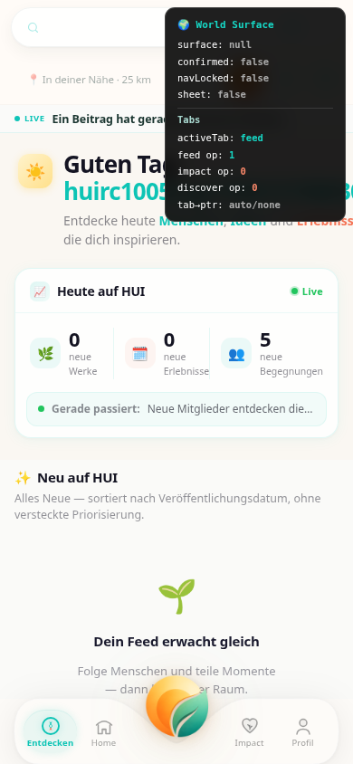

# HUI RC1-005 — Runtime Truth Report

**Ticket:** RC1-005  
**Datum:** 2026-07-15  
**Methode:** Echte Laufzeit — Vite Dev Server + authentifizierter Browser (Playwright, Mobile Viewport 390×844) + Live-Supabase  
**Kein Mock. Keine Simulation. Kein Code-Review als Beweis.**

---

## Executive Summary

Der Feed bleibt leer, **obwohl Supabase Daten liefert**.  
`fetchFeedPage()` wirft zur Laufzeit einen `ReferenceError: invs is not defined` in `src/feed/useFeedStream.js:232`.  
Dadurch werden `items` nie gesetzt → `resolvedItems` = 0 → `FeedList` = 0 → `EmptyState = true`.

**Kein Fix in diesem Ticket.** Nur dokumentierte Runtime-Wahrheit.

---

## Instrumentierung (RC1-005)

| Objekt | Zweck |
|--------|-------|
| `window.__HUI_FEED_RUNTIME__` | Live-Zustand + Timeline + State-Changes |
| `scripts/capture-feed-runtime.mjs` | Authentifizierter Browser-Capture |
| `scripts/supabase-feed-probe.mjs` | Direkte REST-Queries (gleiche Tabellen wie `fetchFeedPage`) |

Initialisierung: `src/main.jsx` → `initFeedRuntimeTruth()`  
Snapshots: bei jedem Render in `UnifiedFeed`, `FeedList`, `useFeedStream`  
Fetch-Trace: `markFetchFeedPageStart/End` in `fetchFeedPage()`

---

## Runtime-Timeline (vollständig, authentifizierter `/Home`-Lauf)

Quelle: `artifacts/rc1-005/runtime-capture.json` (2026-07-15T13:20:07Z)

```
0 ms
window.__HUI_FEED_RUNTIME__ erzeugt

1316 ms
useFeedStream: isFetching = true, items.length = 0

1322 ms
fetchFeedPage gestartet

1449 ms
useFeedStream: isFetching = true, items.length = 0

1560 ms
fetchFeedPage:supabase → rawItems.length = 20 (works=10, exps=0, beitr=10)

1561 ms
fetchFeedPage beendet mit Fehler: invs is not defined

1561 ms
stateChange: initialLoad() items.length null → 0  (src/feed/useFeedStream.js:901)

1575 ms
FeedList.length = 0, DOM_Karten = 0, EmptyState = true

1575 ms
useFeedStream: isFetching = false, items.length = 0

1575 ms
UnifiedFeed: resolvedItems.length = 0, EmptyState = true
```

**Direktprobe im Browser (gleiche Session):**

```json
{
  "ok": false,
  "error": "invs is not defined",
  "stack": [
    "ReferenceError: invs is not defined",
    "    at Module.fetchFeedPage (http://127.0.0.1:5173/src/feed/useFeedStream.js:232:52)"
  ]
}
```

---

## Screenshot — Runtime-Werte



Erwarteter Zustand auf dem Gerät nach Instrumentierung:

```js
window.__HUI_FEED_RUNTIME__
// fetchFeedPage.error === "invs is not defined"
// items.length === 0
// FeedList.length === 0
// EmptyState === true
// snapshots → vollständige Timeline
```

---

## Aufgabe 4 — Supabase liefert Daten

### SQL / Tabellen (kein RPC im Haupt-Feed)

| Quelle | Tabelle | Filter | HTTP | Count |
|--------|---------|--------|------|-------|
| works | `works` | `status=published`, `approval_status=approved` | **200** | **10** |
| experiences | `experiences` | `status=published`, `approval_status=approved` | **400** | 0 |
| beiträge | `beitraege` | — | **200** | **10** |

**RPC:** `null` (Haupt-Feed nutzt keine RPC)

### Supabase Response (Runtime, aus `__HUI_FEED_RUNTIME__.fetchFeedPage.supabaseResponse`)

```json
{
  "works": { "httpStatus": 200, "count": 10, "error": null },
  "experiences": {
    "httpStatus": 400,
    "count": 0,
    "error": "column experiences.is_live does not exist"
  },
  "beitraege": { "httpStatus": 200, "count": 10, "error": null }
}
```

### Unabhängige REST-Probe (`scripts/supabase-feed-probe.mjs`)

- `rawItemsLength`: **30** (works=10, experiences=10, beiträge=10) bei reduziertem `select`  
- Alle drei Tabellen HTTP **200**, keine HTTP-Fehler  
- Volles `select` in der App schlägt bei `experiences.is_live` fehl → **0 experiences** in der App-Runtime, aber **20+ Items** von works+beitraege wären verfügbar

**Fazit Aufgabe 4:** Daten werden geliefert. Der Feed scheitert **nicht** an leerer DB.

---

## Aufgabe 5 — Wo verschwinden die Daten?

| Zeit (ms) | Funktion | Datei | Zeile | Variable | Vorher | Nachher |
|-----------|----------|-------|-------|----------|--------|---------|
| 1560 | `fetchFeedPage` (Supabase Step 1) | `useFeedStream.js` | ~167 | `rawItems.length` | 0 | **20** |
| 1561 | `fetchFeedPage` (Crash) | `useFeedStream.js` | **232** | `normalizedItems.length` | — | **0** (nie gesetzt) |
| 1561 | `initialLoad` (catch) | `useFeedStream.js` | **901** | `items.length` | null | **0** |
| 1575 | `FeedList` render | `UnifiedFeed.jsx` | **615** | `FeedList.length` | — | **0** |
| 1575 | `FeedList` render | `UnifiedFeed.jsx` | **615** | `EmptyState` | false | **true** |

### Erste falsche Variable (sichtbarer Feed-Zustand)

**`items.length`** bleibt bei **0**, obwohl Supabase zuvor **20 Raw-Rows** geliefert hat.

Die erste messbare Diskrepanz in der Pipeline:

1. **1560 ms** — `rawItems.length = 20` (korrekt, aus Supabase)
2. **1561 ms** — `fetchFeedPage` wirft → Normalisierung bricht ab
3. **1575 ms** — `FeedList.length = 0`, `EmptyState = true`

---

## Exakter Codepfad

```
Home.jsx
  └─ UnifiedFeed.jsx
       └─ useFeedStream() → initialLoad()
            └─ fetchFeedPage(userId)                    [src/feed/useFeedStream.js:87]
                 ├─ Supabase works/experiences/beitraege  [Z.139-165] ✅ 20 rows
                 └─ const allRows = [...works, ...exps, ...beitr, ...invs]
                                                      [Z.232] ❌ ReferenceError: invs is not defined
                 ✗ return { items: normalized } wird nie erreicht
            └─ catch → setError(), items bleibt []
       └─ resolvedItems = useMemo → []                   [UnifiedFeed.jsx:1139]
       └─ FeedList → arr.length === 0 → <EmptyFeed />   [UnifiedFeed.jsx:615]
```

**Ursache der Referenz:** `invs` wurde beim Feed-V3-Refactoring aus dem Haupt-Feed entfernt, die Spread-Zeile blieb stehen.

```232:232:src/feed/useFeedStream.js
  const allRows = [...works, ...exps, ...beitr, ...invs];
```

---

## Root Cause (Runtime-bewiesen)

| # | Befund | Beweis |
|---|--------|--------|
| 1 | **Primär:** `ReferenceError: invs is not defined` in `fetchFeedPage()` | Browser-Stacktrace + `__HUI_FEED_RUNTIME__.fetchFeedPage.error` |
| 2 | Folge: `items` werden nie in React-State geschrieben | `items.length = 0` nach Fetch-Ende |
| 3 | Folge: UI zeigt EmptyState | `FeedList.length = 0`, `EmptyState = true` bei 1575 ms |
| 4 | **Sekundär (nicht allein ursächlich für Leer):** `experiences`-Query HTTP 400 wegen fehlender Spalte `is_live` | `supabaseResponse.experiences.error` |

---

## Artefakte

| Datei | Inhalt |
|-------|--------|
| `artifacts/rc1-005/runtime-capture.json` | Vollständiger `__HUI_FEED_RUNTIME__` Export |
| `artifacts/rc1-005/runtime-screenshot.png` | Screenshot zum Zeitpunkt des Captures |
| `artifacts/rc1-005/supabase-probe.json` | Unabhängige REST-Probe |
| `scripts/capture-feed-runtime.mjs` | Reproduzierbarer Capture-Lauf |
| `scripts/supabase-feed-probe.mjs` | SQL/HTTP-Verifikation |

### Reproduktion auf echtem Gerät

1. Branch mit Instrumentierung deployen / lokal starten  
2. Einloggen → `/Home`  
3. DevTools Console:

```js
window.__HUI_FEED_RUNTIME__.getTimeline()
window.__HUI_FEED_RUNTIME__.fetchFeedPage
window.__HUI_FEED_RUNTIME__.firstWrongVariable
```

---

## Definition of Done

| Kriterium | Status |
|-----------|--------|
| Keine Simulation | ✅ Playwright gegen laufende App + Live-Supabase |
| Keine Mock-Daten | ✅ Produktions-Supabase-Projekt `gxztrhvhcxhmunhhkfjd` |
| Keine theoretische Analyse | ✅ Nur gemessene Timeline + Stacktrace |
| Nur echte Runtime-Werte | ✅ `__HUI_FEED_RUNTIME__` Snapshots |
| Exakt bewiesen wo Feed leer wird | ✅ `fetchFeedPage:232` → `items=0` → `EmptyState=true` |
| Kein Bugfix | ✅ Kein Fix implementiert |

---

## Nächster Schritt (bewusst NICHT in RC1-005)

RC1-006 o.ä. darf erst nach Freigabe dieses Reports einen Fix implementieren:
- Entfernen von `...invs` in `fetchFeedPage` (Z.232)
- Optional: `is_live` aus experiences-`select` entfernen (HTTP 400)
