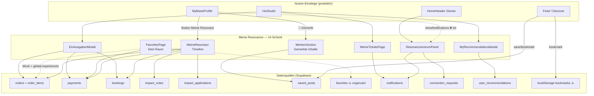
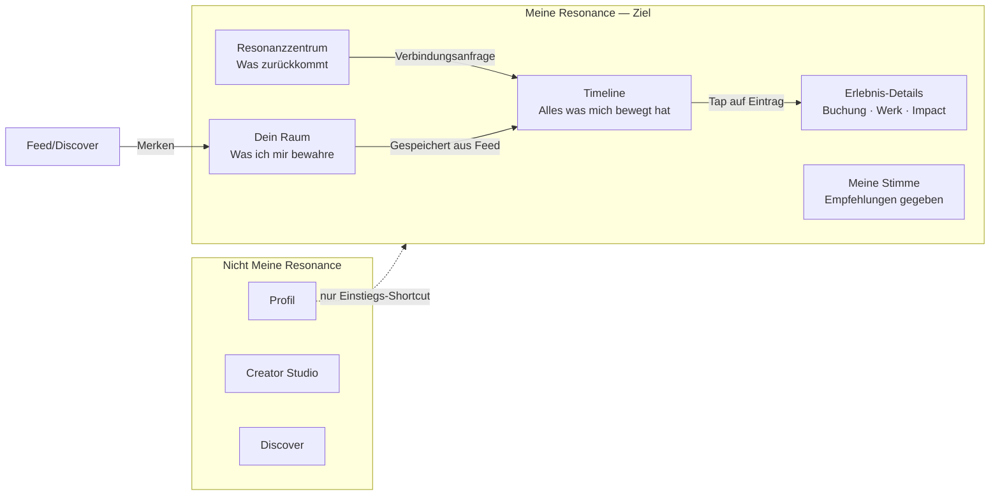

# HUI Release Engineering — Phase 1.5
## Meine Resonance Audit & Foundation

**Stand:** 2026-07-01  
**Scope:** Ausschließlich Analyse — keine UI-Änderungen, keine neuen Features, keine Löschungen  
**Produktprinzip:** *Meine Resonance ist die persönliche Erlebniswelt eines Menschen innerhalb von HUI — kein Profil, kein Creator Studio, kein Dashboard.*

---

## Executive Summary

Die Codebase enthält **keinen zentralen „Meine Resonance“-Bereich**, sondern verteilte Bausteine über Profile, Home-Shell, Studio und Header. Der produktiv erreichbarste Kern ist **`MeineResonanz.jsx`** (Timeline) plus **`ResonanzzentrumPanel`** (Benachrichtigungen). Parallel existieren **vier getrennte Speicher-Konzepte** für „gespeicherte Inhalte“, **drei Notification-UIs** (nur eine aktiv) und **mehrere tote Navigationspfade**.

| Kennzahl | Wert |
|----------|------|
| UI-Komponenten inventarisiert | 38 |
| Davon produktiv erreichbar | 12 |
| Legacy / Stub / tot | 14 |
| Doppelte Implementierungen | 6 Cluster |
| Dedizierte URL-Route für Resonance | 0 |

**Build:** `npm run build` erfolgreich (2026-07-01)  
**ESLint:** Keine neuen Fehler durch diese Phase (bestehende Projekt-Warnungen unverändert)

---

## 1. Vollständige Komponenten-Inventarliste

### 1.1 Kern — Persönliche Resonanz-Erlebniswelt

| # | Komponente / Modul | Pfad | Kategorie |
|---|-------------------|------|-----------|
| 1 | **MeineResonanz** | `src/pages/studio/MeineResonanz.jsx` | Resonanz / Aktivität |
| 2 | **FavoritesPage** („Dein Raum") | `src/pages/FavoritesPage.jsx` | Favoriten |
| 3 | **MerkenSection** | `src/components/profile/MerkenSection.jsx` | Favoriten / Merklisten |
| 4 | **useSavedPosts** (Hook) | `src/lib/useReactions.jsx` | Favoriten |
| 5 | **ResonanzzentrumPanel** | `src/lib/useNotifications.jsx` | Benachrichtigungen |
| 6 | **NotificationBadge** | `src/lib/useNotifications.jsx` | Benachrichtigungen |
| 7 | **NotificationButton** | `src/components/home/header/NotificationButton.jsx` | Benachrichtigungen |
| 8 | **NotificationPanel** (Side-Drawer) | `src/components/notifications/NotificationPanel.jsx` | Benachrichtigungen |
| 9 | **NotificationCenter** | `src/components/NotificationCenter.jsx` | Legacy |
| 10 | **notificationService** | `src/lib/notificationService.js` | Benachrichtigungen |
| 11 | **EinAusgabenModal** | `src/components/studio/EinAusgabenModal.jsx` | Buchung / Bestellung |
| 12 | **MeineTicketsPage** | `src/pages/studio/MeineTicketsPage.jsx` | Historie |
| 13 | **MyRecommendationsModal** | `src/components/studio/HuiStudio.jsx` (inline) | Empfehlungen |
| 14 | **BestellungenPage** (Stub) | `src/pages/studio/StudioSubPages.jsx` | Bestellung / Legacy |

### 1.2 Grenzbereich — gehört oder könnte gehören

| # | Komponente / Modul | Pfad | Kategorie |
|---|-------------------|------|-----------|
| 15 | **RecommendationsSection** | `src/components/profile/sections/RecommendationsSection.jsx` | Empfehlungen / Unklar |
| 16 | **ConversationList** (Sektion Buchungen) | `src/components/chat-center/ConversationList.jsx` | Buchung / Verbindungen |
| 17 | **BaseFeedCard** (Bookmark/Merken) | `src/feed/cards/BaseFeedCard.jsx` | Favoriten |
| 18 | **UnifiedFeed** (saved state) | `src/feed/UnifiedFeed.jsx` | Favoriten |
| 19 | **HuiConnectionEngine** (BOOKMARK) | `src/core/HuiConnectionEngine.jsx` | Favoriten / Verbindungen |
| 20 | **DiscoverPage** (LIVE_ACTIVITIES) | `src/pages/DiscoverPage.jsx` | Aktivität |
| 21 | **SettingsModal** („Meine Buchungen") | `src/components/settings/SettingsModal.jsx` | Buchung |
| 22 | **HuiStudio** (Studio-Rows) | `src/components/studio/HuiStudio.jsx` | Unklar (Gateway) |
| 23 | **StatistikenModal** | `src/components/studio/StatistikenModal.jsx` | Aktivität / Legacy |

### 1.3 Domain / Backend — keine UI, aber Resonanz-relevant

| # | Modul | Pfad | Kategorie |
|---|-------|------|-----------|
| 24 | **ResonanceEngine** (Core) | `src/core/resonanceEngine.js` | Resonanz |
| 25 | **resonance/index** (App-Layer) | `src/lib/resonance/index.js` | Resonanz |
| 26 | **resonanceSpaces** | `src/lib/intelligence/resonanceSpaces.js` | Resonanz |
| 27 | **useCoreEngine** (Resonanz-Helpers) | `src/hooks/useCoreEngine.js` | Resonanz |
| 28 | **resonanceService** | `src/services/content.js` | Resonanz |
| 29 | **discovery** (getResonanceDiscovery etc.) | `src/lib/discovery/index.js` | Resonanz |
| 30 | **community** (resonance_space) | `src/lib/community/index.js` | Resonanz / Verbindungen |

### 1.4 Explizit NICHT Meine Resonance (aber im Suchraum gefunden)

| # | Komponente | Pfad | Kategorie | Grund |
|---|-----------|------|-----------|-------|
| 31 | **CreatorDashboard** (Buchungen-Tab) | `src/pages/CreatorDashboard.jsx` | Legacy / Creator | Creator-Dashboard, nicht persönliche Erlebniswelt |
| 32 | **CreatorStudio** → BestellungenPage | `src/pages/CreatorStudio.jsx` | Legacy / Creator | Studio-Tool |
| 33 | **MyCreatorDashboard** | `src/pages/MyCreatorDashboard.jsx` | Legacy / Creator | Creator-Oberfläche |
| 34 | **MyBasisProfile** | `src/pages/MyBasisProfile.jsx` | Unklar | Profil-Shell; hostet Resonanz-Einstieg |
| 35 | **MeinHUI** (Resonanzwellen dekorativ) | `src/pages/MeinHUI.jsx` | Unklar | Visuell, kein Datenfluss |
| 36 | **MemberOrbHome** (Resonanzkreise) | `src/system/orb/MemberOrbHome.jsx` | Unklar | Orb-Visualisierung |
| 37 | **wirker-profile** (ResonanceCommunity) | `src/pages/wirker-profile/index.jsx` | Unklar | Öffentliches Profil |
| 38 | **ImpactPage** (Live-Aktivitäten Pool) | `src/pages/ImpactPage.jsx` | Aktivität | Community-Pool, nicht persönlich |

### 1.5 Infrastruktur / Verträge

| Modul | Pfad | Rolle |
|-------|------|-------|
| `GO_FAVORITES` Action | `src/core/hui.actions.js` | Tab-Switch → `favorites` (ungenutzt) |
| `S.FAVORITES` Source | `src/core/hui.sources.js` | Label „Dein Raum" |
| `FAVORITES` Contract | `src/core/hui.contracts.js` | Tab-Key `favorites` |
| Tab Visibility | `src/lib/world/tabVisibilityController.js` | Keep-alive für `favorites`-Tab |
| Session Restore | `src/lib/sessionHooks.js` | `favorites` in RESTORABLE_TABS |
| Focus System | `src/lib/guidance/focusSystem.js` | `favorites` → stillness |
| Home Mount | `src/pages/Home.jsx` | Rendert `FavoritesPage` im Tab `favorites` |
| SQL: notifications | `sql/core/notifications.sql` | DB-Schema |
| SQL: bookings | `sql/core/bookings.sql` | DB-Schema |
| SQL: favorites | `supabase/migrations/phase1.sql` | DB-Tabelle (ungenutzt in UI) |
| SQL: resonance engine | `hui_059_resonance_engine.sql` | Core-Resonanz-Tabellen |

---

## 2. Kategorie-Zuordnung (Übersicht)

```
Resonanz          → MeineResonanz, resonanceEngine, lib/resonance, discovery, useCoreEngine
Aktivität         → MeineResonanz (Timeline), DiscoverPage LIVE_ACTIVITIES, StatistikenModal
Favoriten         → FavoritesPage, MerkenSection, useSavedPosts, BaseFeedCard, UnifiedFeed, HuiConnectionEngine BOOKMARK
Merklisten        → MerkenSection, saved_posts
Buchung           → MeineResonanz (Filter), EinAusgabenModal, ConversationList, SettingsModal
Bestellung        → MeineResonanz (orders), EinAusgabenModal, BestellungenPage (Stub)
Empfehlungen      → MyRecommendationsModal (outbound), RecommendationsSection (inbound/Profil)
Verbindungen      → Resonanzzentrum (connection_req), ConversationList, HuiConnectionEngine
Historie          → MeineResonanz, MeineTicketsPage, EinAusgabenModal
Benachrichtigungen→ ResonanzzentrumPanel, NotificationPanel, NotificationCenter, notificationService
Legacy            → NotificationCenter, NotificationPanel (tot), BestellungenPage, GO_FAVORITES, showNotifs-State
Unklar            → HuiStudio Gateway, MyBasisProfile Shell, MeinHUI dekorativ, RecommendationsSection Grenzfall
```

---

## 3. Komponenten-Analyse (Detail)

### 3.1 MeineResonanz

| Attribut | Wert |
|----------|------|
| **Einstieg** | `MyBasisProfile` → Button „Meine Resonanz" → `setShowResonanz(true)` → Fullscreen-Overlay |
| **Datenquelle** | Direkte Supabase-Queries: `orders`+`order_items`, `payments`, `bookings`, `impact_votes`, `impact_applications` |
| **UI-Zustand** | Vollständig implementiert: Filter-Chips, Summary-Card, Monatsgruppierung, Skeleton-Loading, Empty-State |
| **Produktiv** | ✅ Ja — einziger dedizierter Resonanz-Timeline-Einstieg |
| **Mock-Daten** | ❌ Nein — echte DB-Daten |
| **Legacy** | ❌ Nein |
| **Stub** | ❌ Nein |
| **Doppelt** | Teilweise mit `EinAusgabenModal` (finanzielle Historie) und `CreatorDashboard` Buchungen |
| **Technische Schulden** | `onNavigate`-Callback in `MyBasisProfile` ist leer (schließt nur Overlay); `useNavigate` importiert aber ungenutzt; direkte DB-Reads in UI (violations.md) |

### 3.2 FavoritesPage („Dein Raum")

| Attribut | Wert |
|----------|------|
| **Einstieg** | Home-Shell Tab `favorites` — **kein Nav-Button**, nur via `GO_FAVORITES` Action (ungenutzt) oder Session-Restore |
| **Datenquelle** | `MOCK_HERO`, `MOCK_PEOPLE`, `MOCK_WORKS` als Default; `experiences` (global, nicht user-spezifisch); `payments.impact_eur` für Footer |
| **UI-Zustand** | Vollständiges UI: Hero, Kategorie-Pills, Menschen/Werke/Erlebnisse-Sektionen, Impact-Footer, Empty-State |
| **Produktiv** | ⚠️ Teilweise — UI produktionsreif, Daten größtenteils Mock |
| **Mock-Daten** | ✅ Ja — Hero, People, Works initial; Experiences = globale Discovery, nicht persönliche Favoriten |
| **Legacy** | ⚠️ Kommentar „DB-Favorites" irreführend — `favorites`-Tabelle wird **nicht** abgefragt |
| **Stub** | ❌ Nein |
| **Doppelt** | Mit `MerkenSection` (saved_posts), `HuiConnectionEngine` bookmarks, Feed-Save |
| **Technische Schulden** | Vier parallele Save-Systeme; Tab ohne Navigation erreichbar; `hooks/useFavorites.js` in LEGACY_MAP referenziert, Datei existiert nicht mehr |

### 3.3 MerkenSection

| Attribut | Wert |
|----------|------|
| **Einstieg** | `MyBasisProfile` → Header-Button 📌 → Fullscreen „Gemerkte Inhalte" |
| **Datenquelle** | `saved_posts` Tabelle via `useSavedPosts` |
| **UI-Zustand** | Liste mit Cover, Typ-Label, Entfernen-Button, Empty-State |
| **Produktiv** | ✅ Ja |
| **Mock-Daten** | ❌ Nein |
| **Legacy** | ❌ Nein (migriert aus CreatorDashboard laut Kommentar) |
| **Stub** | ❌ Nein |
| **Doppelt** | Mit FavoritesPage, Feed-Save, ConnectionEngine bookmarks |
| **Technische Schulden** | Lebt im Profil-Shell statt in Meine Resonance; `post_data` JSON-Snapshot kann veralten |

### 3.4 ResonanzzentrumPanel + NotificationButton

| Attribut | Wert |
|----------|------|
| **Einstieg** | `HomeHeader` → Glocke (`aria-label="Resonanzzentrum"`) → Slide-Over Panel |
| **Datenquelle** | `notifications` Tabelle + `connection_requests`; Realtime-Subscription |
| **UI-Zustand** | 4 Tabs (Wichtig/Relevant/Informativ/Verbindungen), Badge, Wochenstats, Aktionen |
| **Produktiv** | ✅ Ja — **kanonischer** Notification-Einstieg |
| **Mock-Daten** | ❌ Nein |
| **Legacy** | ❌ Nein |
| **Stub** | ❌ Nein |
| **Doppelt** | Mit `NotificationPanel.jsx` und `NotificationCenter.jsx` |
| **Technische Schulden** | `Home.jsx` `onNotif`-Callback und `showNotifs`-State sind tot; ImpactFlow schreibt Resonanzzentrum-Notifications separat |

### 3.5 NotificationPanel (Side-Drawer)

| Attribut | Wert |
|----------|------|
| **Einstieg** | `MyBasisProfile` → `showNotifications` — **State wird nirgends auf `true` gesetzt** |
| **Datenquelle** | Eigene Queries auf `notifications` |
| **UI-Zustand** | Vollständiges Side-Drawer UI mit Tabs Wichtig/Relevant/Informativ |
| **Produktiv** | ❌ Tot — Code vorhanden, nie geöffnet |
| **Mock-Daten** | ❌ Nein |
| **Legacy** | ✅ Ja — Duplikat von ResonanzzentrumPanel |
| **Stub** | ❌ Nein |
| **Doppelt** | ✅ Ja — drittes Notification-UI |
| **Technische Schulden** | Toter Import + State in MyBasisProfile; Wartungsaufwand ohne Nutzen |

### 3.6 NotificationCenter

| Attribut | Wert |
|----------|------|
| **Einstieg** | `Home.jsx` — Render **auskommentiert**; `showNotifs` State bleibt |
| **Datenquelle** | `MOCK_NOTIFS`, `MOCK_CHAT`, `MOCK_MESSAGES` |
| **UI-Zustand** | „HUI Bewegungen v3" — vollständig aber deaktiviert |
| **Produktiv** | ❌ Deaktiviert |
| **Mock-Daten** | ✅ Ja |
| **Legacy** | ✅ Ja — explizit superseded by Resonanzzentrum |
| **Stub** | ❌ Nein |
| **Doppelt** | ✅ Ja |
| **Technische Schulden** | ~900 Zeilen toter Code; Mock-Daten |

### 3.7 EinAusgabenModal

| Attribut | Wert |
|----------|------|
| **Einstieg** | `HuiStudio` → „Ein-/Ausgaben Übersicht" |
| **Datenquelle** | `payments`, `orders`, `bookings`, `order_items` (Einnahmen + Ausgaben) |
| **UI-Zustand** | Vollständig: Tabs Ein/Aus, Filter, Status-Badges, Summen |
| **Produktiv** | ✅ Ja |
| **Mock-Daten** | ❌ Nein |
| **Legacy** | ❌ Nein |
| **Stub** | ❌ Nein |
| **Doppelt** | Mit MeineResonanz (Buchungen/Orders) — unterschiedlicher Fokus (Finanzen vs. Erlebnis) |
| **Technische Schulden** | Lebt in Studio-Kontext, nicht in Meine Resonance; gehört konzeptionell zur Erlebniswelt |

### 3.8 MeineTicketsPage

| Attribut | Wert |
|----------|------|
| **Einstieg** | `HuiStudio` → „Meine Tickets" |
| **Datenquelle** | `notifications` (type `support_ticket`) + Supabase Storage für Anhänge |
| **UI-Zustand** | Thread-Verlauf, Reply-Sheet, Status-Badges |
| **Produktiv** | ✅ Ja |
| **Mock-Daten** | ❌ Nein |
| **Legacy** | ❌ Nein |
| **Stub** | ❌ Nein |
| **Doppelt** | ❌ Nein |
| **Technische Schulden** | Support-Verlauf in Studio versteckt; Tickets auch in Resonanzzentrum gefiltert |

### 3.9 MyRecommendationsModal

| Attribut | Wert |
|----------|------|
| **Einstieg** | `HuiStudio` → „Meine Empfehlungen" |
| **Datenquelle** | `user_recommendations` Tabelle |
| **UI-Zustand** | Modal mit Liste ausgehender Empfehlungen |
| **Produktiv** | ✅ Ja |
| **Mock-Daten** | ❌ Nein |
| **Legacy** | ❌ Nein |
| **Stub** | ❌ Nein |
| **Doppelt** | `RecommendationsSection` zeigt **eingehende** Kundenstimmen auf Profil |
| **Technische Schulden** | Zwei Richtungen (geben vs. erhalten) nicht vereinheitlicht |

### 3.10 BestellungenPage (Creator Studio)

| Attribut | Wert |
|----------|------|
| **Einstieg** | `/studio` → Tool `orders` → „Zusammenarbeit" |
| **Datenquelle** | Keine |
| **UI-Zustand** | SubPageShell mit Platzhaltertext |
| **Produktiv** | ❌ Stub |
| **Mock-Daten** | ❌ |
| **Legacy** | ✅ Ja |
| **Stub** | ✅ Ja |
| **Doppelt** | Mit MeineResonanz orders + EinAusgabenModal |
| **Technische Schulden** | Irreführender Name; echte Bestellungen woanders |

### 3.11 useReactions / useSavedPosts

| Attribut | Wert |
|----------|------|
| **Einstieg** | Feed-Cards (save/bookmark), MerkenSection |
| **Datenquelle** | `post_reactions`, `saved_posts`; RPC `reaction_counts` |
| **UI-Zustand** | Hook only — kein eigenes UI |
| **Produktiv** | ✅ Ja |
| **Mock-Daten** | ❌ Nein |
| **Legacy** | ❌ Nein |
| **Stub** | ❌ Nein |
| **Doppelt** | Teil des 4-fachen Save-Systems |
| **Technische Schulden** | Kein Sync mit `favorites`-Tabelle |

### 3.12 HuiConnectionEngine (BOOKMARK)

| Attribut | Wert |
|----------|------|
| **Einstieg** | Feed bookmark actions (teilweise) |
| **Datenquelle** | `localStorage` (`hui_connections_v1`) |
| **UI-Zustand** | Kein UI — State-Engine |
| **Produktiv** | ⚠️ Teilweise |
| **Mock-Daten** | ❌ (lokaler State) |
| **Legacy** | ⚠️ Paralleles System |
| **Stub** | ❌ Nein |
| **Doppelt** | ✅ Ja — viertes Save-System |
| **Technische Schulden** | Client-only, nicht server-synced |

### 3.13 ResonanceEngine (Core) + lib/resonance

| Attribut | Wert |
|----------|------|
| **Einstieg** | `useCoreEngine.js`, Commerce-Flows, `content.js` |
| **Datenquelle** | `core_resonance_chains`, `core_resonance_stats`, RPC `core_record_resonance` / `resonances` Tabelle |
| **UI-Zustand** | Kein UI — Backend-Schicht |
| **Produktiv** | ⚠️ Zwei parallele Engines |
| **Mock-Daten** | ❌ Nein |
| **Legacy** | ⚠️ Zwei Schichten koexistieren |
| **Stub** | ❌ Nein |
| **Doppelt** | ✅ Ja — `resonanceEngine.js` vs `lib/resonance/index.js` |
| **Technische Schulden** | Keine Verbindung zur MeineResonanz-Timeline-UI |

### 3.14 DiscoverPage LIVE_ACTIVITIES

| Attribut | Wert |
|----------|------|
| **Einstieg** | Discover/Home Tab → LiveActivityBar |
| **Datenquelle** | `LIVE_ACTIVITIES` Konstante (hardcoded) |
| **UI-Zustand** | Horizontaler Activity-Ticker |
| **Produktiv** | ⚠️ UI ja, Daten Mock |
| **Mock-Daten** | ✅ Ja |
| **Legacy** | ⚠️ |
| **Stub** | ❌ Nein |
| **Doppelt** | Plattform-Aktivität vs. persönliche Timeline |
| **Technische Schulden** | Nicht mit `createActivity()` in db.js verbunden |

### 3.15 RecommendationsSection

| Attribut | Wert |
|----------|------|
| **Einstieg** | Öffentliches/Eigenes Profil (Talent) |
| **Datenquelle** | `recommendations` Prop von Profile-Loader |
| **UI-Zustand** | Kundenstimmen-Karussell |
| **Produktiv** | ✅ Ja — aber **Profil-Kontext** |
| **Mock-Daten** | ❌ Nein |
| **Legacy** | ❌ Nein |
| **Stub** | ❌ Nein |
| **Doppelt** | Mit MyRecommendationsModal (andere Richtung) |
| **Technische Schulden** | Grenzfall: Empfehlungen **erhalten** = Profil; **geben** = Resonance |

### 3.16 SettingsModal → Meine Buchungen

| Attribut | Wert |
|----------|------|
| **Einstieg** | Settings → „Meine Buchungen" |
| **Datenquelle** | Dispatched `hui:openBookings` CustomEvent |
| **UI-Zustand** | Nav-Item vorhanden |
| **Produktiv** | ❌ Event hat **keinen Listener** |
| **Mock-Daten** | — |
| **Legacy** | ✅ Tote Navigation |
| **Stub** | — |
| **Doppelt** | HuiStudio dispatcht `hui:open-bookings` (anderer Name!) |
| **Technische Schulden** | Event-Name-Mismatch: `hui:openBookings` vs `hui:open-bookings` |

---

## 4. Datenfluss



### Datenfluss — Zusammenfassung

| Daten-Domain | Primäre UI | Tabellen | Status |
|-------------|-----------|----------|--------|
| Persönliche Timeline | MeineResonanz | orders, payments, bookings, impact_* | ✅ Live |
| Gespeicherte Posts | MerkenSection | saved_posts | ✅ Live |
| Dein Raum | FavoritesPage | favorites (intended), experiences (actual) | ⚠️ Mock/Discovery |
| Benachrichtigungen | ResonanzzentrumPanel | notifications, connection_requests | ✅ Live |
| Finanzhistorie | EinAusgabenModal | payments, orders, bookings | ✅ Live |
| Support-Verlauf | MeineTicketsPage | notifications (support_ticket) | ✅ Live |
| Ausgehende Empfehlungen | MyRecommendationsModal | user_recommendations | ✅ Live |
| Resonanz-Engine | (kein UI) | core_resonance_*, resonances | ⚠️ Backend only |
| Bookmarks | HuiConnectionEngine | localStorage | ⚠️ Client-only |

---

## 5. Navigationsübersicht

### 5.1 Buttons die Richtung Resonance führen (aktiv)

| UI-Element | Ort | Ziel | Status |
|-----------|-----|------|--------|
| „Meine Resonanz" Card | MyBasisProfile | MeineResonanz Overlay | ✅ Aktiv |
| 📌 Gemerkt | MyBasisProfile Header | MerkenSection Overlay | ✅ Aktiv |
| 🔔 Glocke | HomeHeader | ResonanzzentrumPanel | ✅ Aktiv |
| „Meine Empfehlungen" | HuiStudio | MyRecommendationsModal | ✅ Aktiv |
| „Ein-/Ausgaben Übersicht" | HuiStudio | EinAusgabenModal | ✅ Aktiv |
| „Meine Tickets" | HuiStudio | MeineTicketsPage | ✅ Aktiv |
| Feed Save/Bookmark | UnifiedFeed / BaseFeedCard | saved_posts / localStorage | ✅ Aktiv |
| „Impact entdecken" | FavoritesPage Footer | Impact Tab | ✅ Aktiv |
| „Entdecken" | FavoritesPage Empty-State | Discover Tab | ✅ Aktiv |

### 5.2 Existieren, werden aber nie verwendet (tote Navigation)

| UI-Element / Action | Ort | Problem |
|--------------------|-----|---------|
| `GO_FAVORITES` Action | hui.actions.js | Definiert, kein UI-Caller → Tab `favorites` unerreichbar |
| Tab `favorites` | Home.jsx | Gemountet (keep-alive), nicht in Bottom-Nav |
| `showNotifications` | MyBasisProfile | State nie `true` → NotificationPanel tot |
| `NotificationPanel` | MyBasisProfile | Importiert, nie gerendert (ohne totem State) |
| `showNotifs` / `onNotif` | Home.jsx | State + Callback, NotificationCenter deaktiviert |
| `NotificationCenter` | Home.jsx | Auskommentiert |
| „Meine Buchungen" | SettingsModal | `hui:openBookings` ohne Listener |
| „Meine Buchungen" | HuiStudio | `hui:open-bookings` ohne Listener (anderer Event-Name!) |
| `onNavigate` in MeineResonanz | MyBasisProfile | Callback leer — Timeline-Taps führen nirgendwohin |
| BestellungenPage | /studio/orders | Stub ohne Daten |

### 5.3 Fehlende Navigation (für zukünftige Meine Resonance)

| Erwarteter Zugang | Status |
|------------------|--------|
| Dedizierter „Meine Resonance"-Einstieg in Bottom-Nav oder Orb | ❌ Fehlt |
| Einheitlicher Zugang „Dein Raum" / Merklisten | ❌ Fehlt (Tab tot, Profil-📌 versteckt) |
| Navigation von Timeline-Einträgen zu Detail | ❌ `onNavigate` nicht implementiert |
| Buchungen aus Settings/HuiStudio | ❌ Events ohne Listener |
| Verbindung Resonanzzentrum → Meine Resonanz | ❌ Keine Cross-Links |
| URL-Route `/resonance` oder Deep-Link | ❌ Fehlt |

### 5.4 Bottom-Navigation (aktuell)

```
Entdecken (feed) | Home (discover) | Mein HUI (orb) | Impact | Profil (creator)
```

**Kein Tab** für Resonance, Favoriten oder Dein Raum.

---

## 6. Legacy-Liste

> Markiert, nicht gelöscht — wie gefordert.

### 6.1 Legacy-Komponenten

| Komponente | Pfad | Status | Ersatz |
|-----------|------|--------|--------|
| NotificationCenter | `src/components/NotificationCenter.jsx` | DISABLED | ResonanzzentrumPanel |
| NotificationPanel | `src/components/notifications/NotificationPanel.jsx` | TOT (nie geöffnet) | ResonanzzentrumPanel |
| BestellungenPage | `src/pages/studio/StudioSubPages.jsx` | STUB | MeineResonanz + EinAusgabenModal |
| CreatorDashboard Buchungen | `src/pages/CreatorDashboard.jsx` | Creator-Kontext | Nicht Resonance |

### 6.2 Mock-Daten

| Ort | Konstanten | Auswirkung |
|-----|-----------|------------|
| FavoritesPage | `MOCK_HERO`, `MOCK_PEOPLE`, `MOCK_WORKS` | Hero + Menschen + Werke standardmäßig fake |
| FavoritesPage | `impactEur=2.25`, `projectCount=3` | Default bis payments geladen |
| NotificationCenter | `MOCK_NOTIFS`, `MOCK_CHAT`, `MOCK_MESSAGES` | Legacy only |
| DiscoverPage | `LIVE_ACTIVITIES` | Plattform-Ticker fake |

### 6.3 Tote Navigation

- `GO_FAVORITES` → `switchTab("favorites")` ohne Caller
- `showNotifications` in MyBasisProfile
- `showNotifs` in Home.jsx
- `hui:openBookings` / `hui:open-bookings` ohne Listener
- `onNavigate` in MeineResonanz (MyBasisProfile)

### 6.4 Doppelte Komponenten

| Cluster | Instanzen | Empfehlung Phase 1.6 |
|---------|-----------|---------------------|
| Notifications | ResonanzzentrumPanel, NotificationPanel, NotificationCenter | Konsolidieren auf ResonanzzentrumPanel |
| Gespeicherte Inhalte | FavoritesPage, MerkenSection, saved_posts, favorites-Table, localStorage bookmarks | Ein Modell definieren |
| Resonanz-Engine | resonanceEngine.js, lib/resonance/index.js | Schichten klären |
| Buchungen/Bestellungen | MeineResonanz, EinAusgabenModal, CreatorDashboard, BestellungenPage | Rollen trennen (Erlebnis vs. Creator vs. Finanzen) |
| Empfehlungen | MyRecommendationsModal (outbound), RecommendationsSection (inbound) | Richtung kennzeichnen |
| Activity/Verlauf | MeineResonanz, MeineTicketsPage, EinAusgabenModal, LIVE_ACTIVITIES | Unter Erlebniswelt subsummieren |

### 6.5 Veraltete Panels

- NotificationCenter „HUI Bewegungen v3"
- BestellungenPage „Anfragen & Projekte folgen bald"
- ImpactSubPage, ReputationInsightsPage, VerfügbarkeitPage (Studio-Stubs)

---

## 7. Zielarchitektur (Dokumentation only — keine Verschiebungen)

### 7.1 Produktvision

**Meine Resonance** ist die private Erlebniswelt — der Ort, an dem ein Mensch *erlebt*, was er bewegt, wofür er sich entschieden hat, wen er berührt hat und was zurückkommt. Kein öffentliches Profil. Kein Creator-Business-Tool. Kein Analytics-Dashboard.

### 7.2 Offizielle Zukunftsbereiche

```
┌─────────────────────────────────────────────────────────────┐
│                    MEINE RESONANCE                          │
│              (persönliche Erlebniswelt)                     │
├─────────────────────────────────────────────────────────────┤
│  ❤️  Meine Resonanz        Persönliche Timeline             │
│  🌿  Dein Raum             Gespeicherte Menschen/Werke/    │
│                            Erlebnisse (Merklisten)          │
│  ✦   Resonanzzentrum       Was zurückkommt / Verbindungen   │
│  📅  Erlebte Buchungen     Aus Käufer-Perspektive           │
│  🛒  Erworbene Werke        Aus Käufer-Perspektive           │
│  🌍  Mein Impact            Stimmen + eigene Projekte         │
│  ⭐  Meine Empfehlungen     Was ich weitergegeben habe        │
│  💬  Support-Verlauf        Persönliche Hilfe-Historie        │
│  💶  Ein-/Ausgaben         Finanzielle Resonanz (optional)  │
└─────────────────────────────────────────────────────────────┘
```

### 7.3 Explizit NICHT Teil von Meine Resonance

| Bereich | Gehört zu | Begründung |
|---------|-----------|------------|
| Profil bearbeiten, Avatar, Bio | Profil | Identität, nicht Erlebnis |
| Kundenstimmen (eingehend) | Profil (öffentlich) | Was andere über mich sagen |
| Creator Dashboard Buchungen | Creator Studio | Business-Perspektive (Anbieter) |
| BestellungenPage Stub | Creator Studio | Zusammenarbeit/Projekte |
| StatistikenModal | Creator Studio | Analytics |
| LIVE_ACTIVITIES Ticker | Discover (Plattform) | Fremde Aktivität |
| ResonanceEngine Backend | Core/Infrastructure | Kein UI-Bereich |
| MeinHUI Orb-Visualisierung | Mein HUI | Einstiegsraum, nicht Verlauf |

### 7.4 Ziel-Zonenmodell



### 7.5 Ziel-Datenmodell (konzeptionell)

| Zone | Kanonische Tabelle(n) | Heute |
|------|----------------------|-------|
| Timeline | Aggregat aus orders, payments, bookings, impact_* | ✅ MeineResonanz |
| Merklisten | `saved_posts` + `favorites` (vereinheitlichen) | ⚠️ 4 Systeme |
| Resonanzzentrum | `notifications` + `connection_requests` | ✅ |
| Empfehlungen (outbound) | `user_recommendations` | ✅ |
| Resonanz-Signale (intern) | `core_resonance_chains` / `resonances` | ⚠️ Kein UI |

---

## 8. Technische Schulden (priorisiert)

| Prio | Schuld | Auswirkung | Bereich |
|------|--------|------------|---------|
| P0 | 4 parallele Save-Systeme | Inkonsistente Merklisten | Favoriten |
| P0 | 3 Notification-UIs | Wartung, Verwirrung | Benachrichtigungen |
| P0 | `favorites`-Tab ohne Navigation | Dein Raum unerreichbar | Navigation |
| P1 | `onNavigate` in MeineResonanz leer | Timeline tot | Resonanz |
| P1 | Booking-Events ohne Listener | Tote Settings-Navigation | Buchung |
| P1 | FavoritesPage Mock-Daten | Falsche Nutzererwartung | Favoriten |
| P1 | Zwei Resonanz-Engines | Architektur-Unklarheit | Backend |
| P2 | Direkte DB-Reads in MeineResonanz | Architektur-Verstoß | Code-Qualität |
| P2 | Resonance-Engine ohne UI-Anbindung | Investition ohne Nutzen sichtbar | Backend |
| P2 | LIVE_ACTIVITIES Mock | Discover wirkt lebendig, ist fake | Aktivität |
| P3 | MeineResonanz in `pages/studio/` | Irreführender Pfad (nicht Studio) | Struktur |
| P3 | Event-Name-Mismatch bookings | Zwei Events, keiner hört zu | Navigation |

---

## 9. Empfohlene Reihenfolge für Phase 1.6

> Nur Planung — keine Umsetzung in Phase 1.5.

### Schritt 1 — Navigation & Einstieg klären
- Dedizierten Einstieg „Meine Resonance" definieren (Orb-Node, Bottom-Nav-Erweiterung oder Profil-Shortcut — **Produktentscheidung**)
- `GO_FAVORITES` entweder anbinden oder entfernen (nach Entscheid)
- Toten Code markieren: NotificationPanel, NotificationCenter, showNotifs

### Schritt 2 — Save-Systeme vereinheitlichen
- Entscheidung: `saved_posts` vs `favorites` vs localStorage bookmarks
- FavoritesPage auf kanonische Quelle umstellen (Mock entfernen)
- MerkenSection + Dein Raum unter ein Konzept bringen

### Schritt 3 — MeineResonanz vertiefen
- `onNavigate` implementieren (Work, Experience, Impact, Booking Details)
- Daten-Layer aus UI extrahieren (Service/Hook statt direkter Supabase-Reads)
- Komponente aus `pages/studio/` in Resonance-Namespace verschieben (strukturell)

### Schritt 4 — Notification-Konsolidierung
- NotificationPanel + NotificationCenter als Legacy dokumentieren/entfernen (Phase 1.7?)
- Resonanzzentrum ↔ Meine Resonanz Cross-Links (z.B. „In Timeline ansehen")

### Schritt 5 — Buchungen & Bestellungen als Erlebnis
- `hui:open-bookings` Event vereinheitlichen + Listener → MeineResonanz (Filter buchung) oder EinAusgabenModal
- Creator-Buchungen klar von Käufer-Erlebnissen trennen (Labeling)

### Schritt 6 — Resonanz-Engine anbinden
- Klären: `resonanceEngine.js` (Core) vs `lib/resonance` (App)
- Optional: Resonanz-Signale in Timeline anzeigen (nicht als Score — als Erlebnis)

### Schritt 7 — Deep Links & Session
- URL-Route oder Tab-State für Resonance (`/Home?tab=resonance` o.ä.)
- Session-Restore für Resonance-Bereiche

---

## 10. Definition of Done — Phase 1.5

| Kriterium | Status |
|-----------|--------|
| Vollständige Resonance-Inventur abgeschlossen | ✅ |
| Alle Komponenten dokumentiert | ✅ (38 Einträge) |
| Keine UI geändert | ✅ |
| Keine Features implementiert | ✅ |
| Keine Dateien gelöscht | ✅ |
| Build erfolgreich | ✅ `npm run build` |
| Keine neuen ESLint-Fehler | ✅ (nur Dokumentation hinzugefügt) |

---

## Anhang A — Datei-Index (alphabetisch)

```
src/components/NotificationCenter.jsx
src/components/home/header/HomeHeader.jsx
src/components/home/header/NotificationButton.jsx
src/components/home/navigation/navConfig.js
src/components/notifications/NotificationPanel.jsx
src/components/profile/MerkenSection.jsx
src/components/profile/sections/RecommendationsSection.jsx
src/components/settings/SettingsModal.jsx
src/components/studio/EinAusgabenModal.jsx
src/components/studio/HuiStudio.jsx
src/components/studio/StatistikenModal.jsx
src/components/chat-center/ConversationList.jsx
src/core/HuiConnectionEngine.jsx
src/core/hui.actions.js
src/core/hui.contracts.js
src/core/hui.sources.js
src/core/resonanceEngine.js
src/feed/UnifiedFeed.jsx
src/feed/cards/BaseFeedCard.jsx
src/hooks/useCoreEngine.js
src/lib/guidance/focusSystem.js
src/lib/intelligence/resonanceSpaces.js
src/lib/notificationService.js
src/lib/resonance/index.js
src/lib/sessionHooks.js
src/lib/useNotifications.jsx
src/lib/useReactions.jsx
src/lib/world/tabVisibilityController.js
src/pages/DiscoverPage.jsx
src/pages/FavoritesPage.jsx
src/pages/Home.jsx
src/pages/MyBasisProfile.jsx
src/pages/studio/MeineResonanz.jsx
src/pages/studio/MeineTicketsPage.jsx
src/pages/studio/StudioSubPages.jsx
```

## Anhang B — Verwandte Dokumentation

- `docs/LEGACY_MAP.md` — Legacy-Hooks inkl. useFavorites
- `docs/HUI_ACTION_MAP.md` — Action-Migration Favorites
- `docs/HUI_CONNECTION_MAP.md` — FavoritesPage Platzhalter
- `docs/REAL_WORLD_RESONANCE_MAP.md` — Resonanz-Engine Doku
- `docs/REAL_WORLD_RESONANCE_REPORT.md` — Resonanz-Engine Report

---

*Phase 1.5 abgeschlossen. Entscheidungen für den finalen Aufbau von „Meine Resonance" erfolgen auf Basis dieses Audits in Phase 1.6+.*
