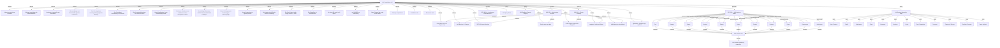

# Authority Graph

```mermaid
graph TD
  CONSTITUTION_CONSTITUTION["HUI Constitution v1.0"]
  RULE_GR_01["Menschen sind keine Produkte."]
  RULE_GR_02["Wirkung ist wichtiger als Aufmerksamkeit."]
  RULE_GR_03["Verbinden ist wertvoller als Reichweite."]
  RULE_GR_04["Wertschöpfung und Gemeinwohl gehören zusammen."]
  RULE_GR_05["Der Orb zeigt keine Leistung. Er zeigt gelebte Wirkung."]
  RULE_GR_06["Der Feed dient Orientierung. Nicht Sucht."]
  RULE_GR_07["Die KI ergänzt Menschen. Sie ersetzt sie nicht."]
  RULE_GR_08["Keine Gamification. Keine Belohnungssysteme."]
  RULE_GR_09["Jede neue Funktion muss mindestens einen Grundpfeiler stärken."]
  RULE_GR_10["Kurzfristiges Wachstum darf die Gemeinschaft nicht schädigen."]
  RULE_ARCH_PRINCIPLE_1["Keine UI-Komponente besitzt eigene Wirkungslogik."]
  RULE_ARCH_PRINCIPLE_2["Keine Engine besitzt eigene Sprache."]
  RULE_ARCH_PRINCIPLE_3["Die Registry ist die Single Source of Meaning."]
  RULE_ARCH_PRINCIPLE_4["Die Core Engine ist die Single Source of Truth."]
  RULE_ARCH_PRINCIPLE_5["Der Datenfluss ist unidirektional."]
  RULE_CORE_BYPASS["Core tables via Core Engine only"]
  RULE_DB_DIRECT_WRITE["No DB writes in UI layers"]
  RULE_DB_DIRECT_READ["No direct DB reads in UI layers"]
  RULE_LAYER_VIOLATION["RFC-000 import direction"]
  RULE_DUPLICATE_OWNER["Single writer per table"]
  RULE_DIRECT_ROUTING["Action Engine required for navigation"]
  RULE_ACTION_ENGINE_GAP["navigate() via Action Engine"]
  RULE_REGISTRY_BYPASS["HuiRegistry for colors/labels"]
  RULE_MISSING_HEADER["@domain + @owner tags required"]
  RULE_POLICY_REALTIME_RT_1[".on() IMMER vor .subscribe()"]
  RULE_POLICY_REALTIME_RT_2["Jeder Channel hat exakt einen Owner"]
  RULE_POLICY_REALTIME_RT_3["Cleanup verpflichtend"]
  RULE_POLICY_REALTIME_RT_4["StrictMode-safe"]
  RULE_POLICY_REALTIME_RT_5["Reconnect-safe"]
  ADR_ADR_001["ADR-001 — Route Authority"]
  ADR_ADR_002["ADR-002 — Architecture Scanner"]
  RFC_RFC_000["RFC-000 — HUI Layering Model"]
  RFC_RFC_000A["RFC-000A — Architecture Governance v1.0"]
  POLICY_POLICY_QUERY_RULES["HUI Query Rules"]
  POLICY_POLICY_REALTIME["HUI Realtime Channel Registry"]
  POLICY_POLICY_OWNERSHIP["HUI System Ownership Map"]
  DOMAIN_CORE["Core"]
  DOMAIN_REGISTRY["Registry"]
  DOMAIN_ROUTES["Routes"]
  DOMAIN_SERVICES["Services"]
  DOMAIN_SYSTEM["System"]
  DOMAIN_HOOKS["Hooks"]
  DOMAIN_CONTEXT["Context"]
  DOMAIN_FEATURES["Features"]
  DOMAIN_PAGES["Pages"]
  DOMAIN_COMPONENTS["Components"]
  DOMAIN_ARCHITECTURE["Architecture"]
  CAP_CAP_AUTH["Auth / Session"]
  CAP_CAP_PROFILE["Profile"]
  CAP_CAP_NOTIF["Notifications"]
  CAP_CAP_CHAT["Chats"]
  CAP_CAP_MESSAGES["Messages"]
  CAP_CAP_BOOKINGS["Bookings"]
  CAP_CAP_WORKS["Works"]
  CAP_CAP_TRUST["Trust / Reputation"]
  CAP_CAP_PRESENCE["Presence"]
  CAP_CAP_PAYMENTS["Payments / Escrow"]
  CAP_CAP_REALTIME["Realtime Channels"]
  CAP_CAP_ROUTING["Route Authority"]
  CODE_CODE["HUI Source Code"]
  RUNTIME_RUNTIME["HUI Runtime (read-only reference)"]
  CONSTITUTION_CONSTITUTION -->|defines| RULE_GR_01
  CONSTITUTION_CONSTITUTION -->|defines| RULE_GR_02
  CONSTITUTION_CONSTITUTION -->|defines| RULE_GR_03
  CONSTITUTION_CONSTITUTION -->|defines| RULE_GR_04
  CONSTITUTION_CONSTITUTION -->|defines| RULE_GR_05
  CONSTITUTION_CONSTITUTION -->|defines| RULE_GR_06
  CONSTITUTION_CONSTITUTION -->|defines| RULE_GR_07
  CONSTITUTION_CONSTITUTION -->|defines| RULE_GR_08
  CONSTITUTION_CONSTITUTION -->|defines| RULE_GR_09
  CONSTITUTION_CONSTITUTION -->|defines| RULE_GR_10
  CONSTITUTION_CONSTITUTION -->|defines| RULE_ARCH_PRINCIPLE_1
  CONSTITUTION_CONSTITUTION -->|defines| RULE_ARCH_PRINCIPLE_2
  CONSTITUTION_CONSTITUTION -->|defines| RULE_ARCH_PRINCIPLE_3
  CONSTITUTION_CONSTITUTION -->|defines| RULE_ARCH_PRINCIPLE_4
  CONSTITUTION_CONSTITUTION -->|defines| RULE_ARCH_PRINCIPLE_5
  CONSTITUTION_CONSTITUTION -->|defines| RULE_CORE_BYPASS
  CONSTITUTION_CONSTITUTION -->|defines| RULE_DB_DIRECT_WRITE
  CONSTITUTION_CONSTITUTION -->|defines| RULE_DB_DIRECT_READ
  CONSTITUTION_CONSTITUTION -->|defines| RULE_LAYER_VIOLATION
  CONSTITUTION_CONSTITUTION -->|defines| RULE_DUPLICATE_OWNER
  CONSTITUTION_CONSTITUTION -->|defines| RULE_DIRECT_ROUTING
  CONSTITUTION_CONSTITUTION -->|defines| RULE_ACTION_ENGINE_GAP
  CONSTITUTION_CONSTITUTION -->|defines| RULE_REGISTRY_BYPASS
  CONSTITUTION_CONSTITUTION -->|defines| RULE_MISSING_HEADER
  CONSTITUTION_CONSTITUTION -->|defines| RULE_POLICY_REALTIME_RT_1
  CONSTITUTION_CONSTITUTION -->|defines| RULE_POLICY_REALTIME_RT_2
  CONSTITUTION_CONSTITUTION -->|defines| RULE_POLICY_REALTIME_RT_3
  CONSTITUTION_CONSTITUTION -->|defines| RULE_POLICY_REALTIME_RT_4
  CONSTITUTION_CONSTITUTION -->|defines| RULE_POLICY_REALTIME_RT_5
  CONSTITUTION_CONSTITUTION -->|governs| ADR_ADR_001
  ADR_ADR_001 -->|enforces| RULE_DIRECT_ROUTING
  ADR_ADR_001 -->|enforces| RULE_ACTION_ENGINE_GAP
  CONSTITUTION_CONSTITUTION -->|governs| ADR_ADR_002
  ADR_ADR_002 -->|enforces| RULE_CORE_BYPASS
  ADR_ADR_002 -->|enforces| RULE_DB_DIRECT_WRITE
  ADR_ADR_002 -->|enforces| RULE_LAYER_VIOLATION
  ADR_ADR_002 -->|enforces| RULE_DUPLICATE_OWNER
  ADR_ADR_002 -->|enforces| RULE_REGISTRY_BYPASS
  ADR_ADR_002 -->|enforces| RULE_MISSING_HEADER
  CONSTITUTION_CONSTITUTION -->|specifies| RFC_RFC_000
  RFC_RFC_000 -->|governs-domain| DOMAIN_CORE
  RFC_RFC_000 -->|governs-domain| DOMAIN_REGISTRY
  RFC_RFC_000 -->|governs-domain| DOMAIN_ROUTES
  RFC_RFC_000 -->|governs-domain| DOMAIN_SERVICES
  RFC_RFC_000 -->|governs-domain| DOMAIN_SYSTEM
  RFC_RFC_000 -->|governs-domain| DOMAIN_HOOKS
  RFC_RFC_000 -->|governs-domain| DOMAIN_CONTEXT
  RFC_RFC_000 -->|governs-domain| DOMAIN_FEATURES
  RFC_RFC_000 -->|governs-domain| DOMAIN_PAGES
  RFC_RFC_000 -->|governs-domain| DOMAIN_COMPONENTS
  CONSTITUTION_CONSTITUTION -->|specifies| RFC_RFC_000A
  CONSTITUTION_CONSTITUTION -->|policy| POLICY_POLICY_QUERY_RULES
  CONSTITUTION_CONSTITUTION -->|policy| POLICY_POLICY_REALTIME
  CONSTITUTION_CONSTITUTION -->|policy| POLICY_POLICY_OWNERSHIP
  RFC_RFC_000 -->|layer-model| DOMAIN_CORE
  RFC_RFC_000 -->|layer-model| DOMAIN_REGISTRY
  RFC_RFC_000 -->|layer-model| DOMAIN_ROUTES
  RFC_RFC_000 -->|layer-model| DOMAIN_SERVICES
  RFC_RFC_000 -->|layer-model| DOMAIN_SYSTEM
  RFC_RFC_000 -->|layer-model| DOMAIN_HOOKS
  RFC_RFC_000 -->|layer-model| DOMAIN_CONTEXT
  RFC_RFC_000 -->|layer-model| DOMAIN_FEATURES
  RFC_RFC_000 -->|layer-model| DOMAIN_PAGES
  RFC_RFC_000 -->|layer-model| DOMAIN_COMPONENTS
  RFC_RFC_000 -->|layer-model| DOMAIN_ARCHITECTURE
  POLICY_POLICY_OWNERSHIP -->|owns| CAP_CAP_AUTH
  POLICY_POLICY_OWNERSHIP -->|owns| CAP_CAP_PROFILE
  POLICY_POLICY_OWNERSHIP -->|owns| CAP_CAP_NOTIF
  POLICY_POLICY_OWNERSHIP -->|owns| CAP_CAP_CHAT
  POLICY_POLICY_OWNERSHIP -->|owns| CAP_CAP_MESSAGES
  POLICY_POLICY_OWNERSHIP -->|owns| CAP_CAP_BOOKINGS
  POLICY_POLICY_OWNERSHIP -->|owns| CAP_CAP_WORKS
  POLICY_POLICY_OWNERSHIP -->|owns| CAP_CAP_TRUST
  POLICY_POLICY_OWNERSHIP -->|owns| CAP_CAP_PRESENCE
  POLICY_POLICY_OWNERSHIP -->|owns| CAP_CAP_PAYMENTS
  POLICY_POLICY_OWNERSHIP -->|owns| CAP_CAP_REALTIME
  POLICY_POLICY_OWNERSHIP -->|owns| CAP_CAP_ROUTING
  DOMAIN_CORE -->|contains| CODE_CODE
  DOMAIN_REGISTRY -->|contains| CODE_CODE
  DOMAIN_ROUTES -->|contains| CODE_CODE
  DOMAIN_SERVICES -->|contains| CODE_CODE
  DOMAIN_SYSTEM -->|contains| CODE_CODE
  DOMAIN_HOOKS -->|contains| CODE_CODE
  DOMAIN_CONTEXT -->|contains| CODE_CODE
  DOMAIN_FEATURES -->|contains| CODE_CODE
  DOMAIN_PAGES -->|contains| CODE_CODE
  DOMAIN_COMPONENTS -->|contains| CODE_CODE
  DOMAIN_ARCHITECTURE -->|contains| CODE_CODE
  CODE_CODE -->|deploys| RUNTIME_RUNTIME
```
