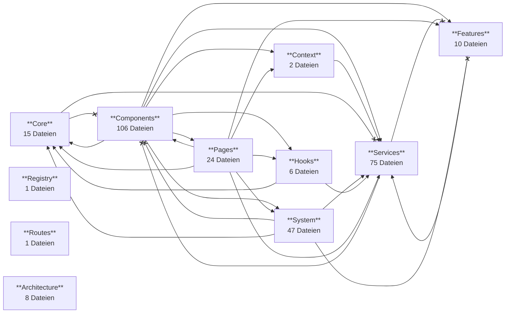
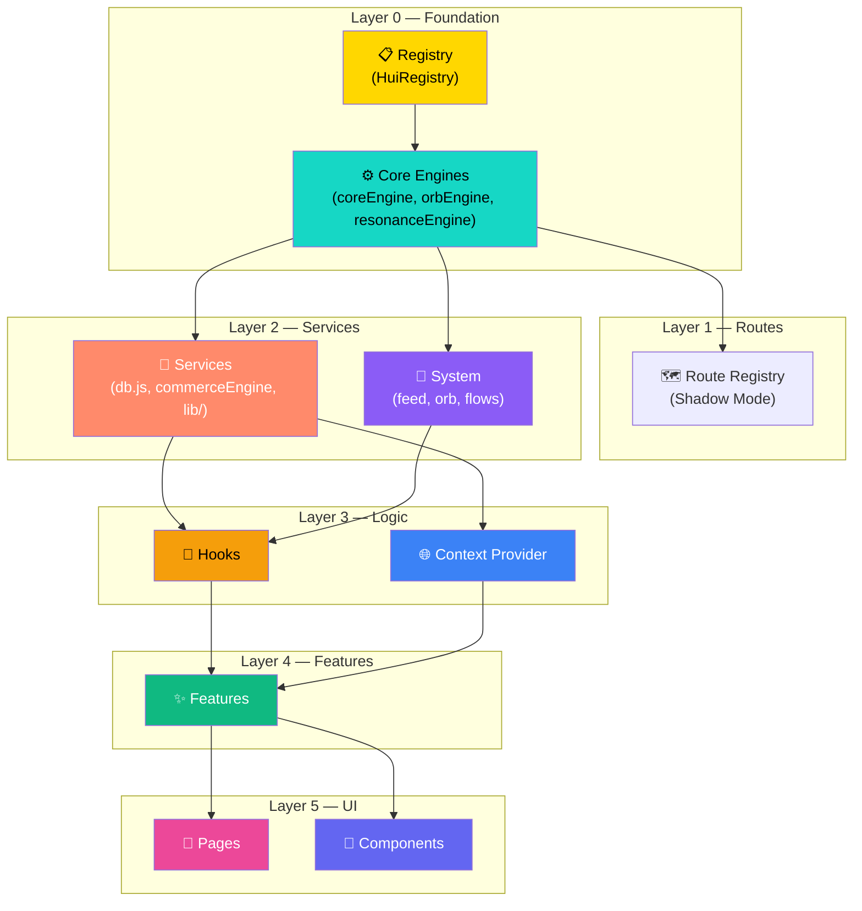
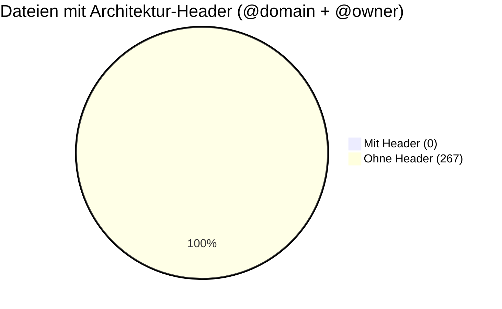

# HUI Dependency Graph

> **Automatisch generiert** — HUI Architecture Scanner (ARCH-001)
> **Datum:** 2026-06-30
> ⚠️ Diese Datei ist autogeneriert. Änderungen werden beim nächsten `npm run architecture:audit` überschrieben.


## Dependency Graph (Top Dateien)

```mermaid
graph TD
  %% HUI Dependency Graph — ARCH-001
  %% Zeigt Datei-zu-Datei Abhängigkeiten (Top 50 nach Verbindungen)

  lib_supabaseClient["supabaseClient<br/>(41×)"]
  lib_supabaseClient["supabaseClient<br/>(29×)"]
  lib_AuthContext["AuthContext<br/>(23×)"]
  design_hui_design["hui.design<br/>(23×)"]
  lib_AuthContext["AuthContext<br/>(22×)"]
  design_hui_design["hui.design<br/>(16×)"]
  supabaseClient["supabaseClient<br/>(15×)"]
  services_db["db<br/>(10×)"]
  sentry[".sentry<br/>(10×)"]
  supabaseClient[".supabaseClient<br/>(8×)"]
  design_hui_interaction["hui.interaction<br/>(7×)"]
  AuthContext["AuthContext<br/>(7×)"]
  OrbConfig["OrbConfig<br/>(7×)"]
  lib_perfUtils["perfUtils<br/>(6×)"]
  lib_supabaseClient["supabaseClient<br/>(6×)"]
  lib_cleanup_cleanupOrbEnvironment["cleanupOrbEnvironment<br/>(5×)"]
  lib_profileUtils["profileUtils<br/>(5×)"]
  components_home_HomeShell["HomeShell<br/>(5×)"]
  hui_sources["hui.sources<br/>(5×)"]
  domains["domains<br/>(4×)"]
  BaseFeedCard["BaseFeedCard<br/>(4×)"]
  hooks_useProfileData["useProfileData<br/>(4×)"]
  ImpactTokens["ImpactTokens<br/>(4×)"]
  lib_AppStateContext["AppStateContext<br/>(3×)"]
  core_hui_actions["hui.actions<br/>(3×)"]
  services_db["db<br/>(3×)"]
  lib_usePresence["usePresence<br/>(3×)"]
  services_creatorEconomy["creatorEconomy<br/>(3×)"]
  ConnectionTypeSidebar["ConnectionTypeSidebar<br/>(3×)"]
  guidanceTokens["guidanceTokens<br/>(3×)"]

```



## Domain Graph



## Layer Graph



## Service Graph

```mermaid
graph LR
  %% HUI Service Graph — ARCH-001
  %% Zeigt Tabellen-Zugriffsmuster pro Service


```

## Ownership Distribution


