# HUI Architecture Knowledge Graph — Mermaid Diagrams

> Automatisch generiert — ARCH-002
> Generiert: 2026-06-30T13:48:06.375Z

⚠️ Nicht manuell bearbeiten. Wird bei `npm run architecture:graph` überschrieben.

## Dependency Graph

## Layer Graph

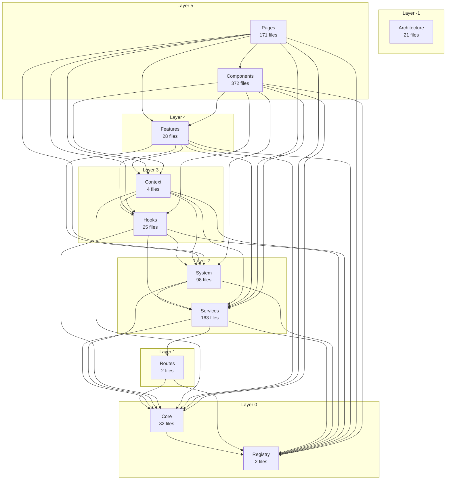

## Ownership Graph

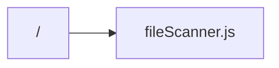

## Context Graph

```mermaid
graph LR
%% HUI Architecture Knowledge Graph — ARCH-002

  Context__AuthContext["AuthContext"]
  File__App_jsx["App.jsx"] --> Context__AuthContext
  File__components_ExperienceCreator_jsx["ExperienceCreator.jsx"] --> Context__AuthContext
  File__components_GemeinschaftsFlow_jsx["GemeinschaftsFlow.jsx"] --> Context__AuthContext
  File__components_HuiCreateFlow_jsx["HuiCreateFlow.jsx"] --> Context__AuthContext
  File__components_HuiMembershipFlow_jsx["HuiMembershipFlow.jsx"] --> Context__AuthContext
  Context__AppStateContext["AppStateContext"]
  File__App_jsx["App.jsx"] --> Context__AppStateContext
  File__components_NotificationCenter_jsx["NotificationCenter.jsx"] --> Context__AppStateContext
  File__components_WorkDetailPage_jsx["WorkDetailPage.jsx"] --> Context__AppStateContext
  File__components_discovery_PeopleSearch_jsx["PeopleSearch.jsx"] --> Context__AppStateContext
  File__components_home_HomeShell_jsx["HomeShell.jsx"] --> Context__AppStateContext
  Context__WorldSurfaceContext["WorldSurfaceContext"]
  File__App_jsx["App.jsx"] --> Context__WorldSurfaceContext
  File__components_home_HomeShell_jsx["HomeShell.jsx"] --> Context__WorldSurfaceContext
  File__pages_Home_jsx["Home.jsx"] --> Context__WorldSurfaceContext
  Context__OrbWorldContext["OrbWorldContext"]
  File__App_jsx["App.jsx"] --> Context__OrbWorldContext
  File__components_home_HomeShell_jsx["HomeShell.jsx"] --> Context__OrbWorldContext
  File__pages_Home_jsx["Home.jsx"] --> Context__OrbWorldContext
  Context__GuidanceContext["GuidanceContext"]
  File__App_jsx["App.jsx"] --> Context__GuidanceContext
  File__components_guidance_GuidanceFooter_jsx["GuidanceFooter.jsx"] --> Context__GuidanceContext
  File__components_guidance_GuidanceLayer_jsx["GuidanceLayer.jsx"] --> Context__GuidanceContext
  Context__AuthGate["AuthGate"]
  Context__AuthGateCtx["AuthGateCtx"]
  File__components_auth_AuthGate_jsx["AuthGate.jsx"] --> Context__AuthGateCtx
  Context__chatContext["chatContext"]
  File__components_chat_center_ChatCenterOverlay_jsx["ChatCenterOverlay.jsx"] --> Context__chatContext
  File__components_chat_center_ConversationRoom_jsx["ConversationRoom.jsx"] --> Context__chatContext
  File__pages_Home_jsx["Home.jsx"] --> Context__chatContext
  Context__GuidanceCtx["GuidanceCtx"]
  File__components_guidance_GuidanceContext_jsx["GuidanceContext.jsx"] --> Context__GuidanceCtx
  Context__HomeShell["HomeShell"]
  Context__HuiActionProvider["HuiActionProvider"]
  File__components_home_HomeShell_jsx["HomeShell.jsx"] --> Context__HuiActionProvider
  Context__HuiContextBridge["HuiContextBridge"]
  File__components_home_HomeShell_jsx["HomeShell.jsx"] --> Context__HuiContextBridge
  Context__HomeCtx["HomeCtx"]
  File__components_home_HomeShell_jsx["HomeShell.jsx"] --> Context__HomeCtx
  Context__OrbWorldCtx["OrbWorldCtx"]
  File__context_OrbWorldContext_jsx["OrbWorldContext.jsx"] --> Context__OrbWorldCtx
  Context__WorldSurfaceCtx["WorldSurfaceCtx"]
  File__context_WorldSurfaceContext_jsx["WorldSurfaceContext.jsx"] --> Context__WorldSurfaceCtx
```

## Service Graph

```mermaid
graph LR
%% HUI Architecture Knowledge Graph — ARCH-002

  t_profiles[("profiles")]
  t_stories[("stories")]
  t_works[("works")]
  t_experiences[("experiences")]
  t_beitraege[("beitraege")]
  t_payments[("payments")]
  t_notifications[("notifications")]
  t_story_views[("story_views")]
  t_messages[("messages")]
  t_project_support[("project_support")]
  t_impact_projects[("impact_projects")]
  t_work_likes[("work_likes")]
  t_work_saves[("work_saves")]
  t_follows[("follows")]
  t_comments[("comments")]
  t_connections[("connections")]
  t_saved_posts[("saved_posts")]
  t_bookings[("bookings")]
  t_orders[("orders")]
  t_order_items[("order_items")]

  Service__AuthContext["AuthContext"]
  Service__AppStateContext["AppStateContext"]
  Service__db["db"]
  Service__chatContext["chatContext"]
  Service__creatorEconomy["creatorEconomy"]
  Service__commerceEngine["commerceEngine"]
  Service__notificationService["notificationService"]
  Service__trustContext["trustContext"]
  Service__bookingContext["bookingContext"]
  Service__journeyContext["journeyContext"]
  Service__content["content"]
```

## Action Graph

```mermaid
graph TD
%% HUI Architecture Knowledge Graph — ARCH-002

  ActionEngine["Action Engine"]
  Action__OPEN_PROFILE["OPEN_PROFILE"]
  ActionEngine --> Action__OPEN_PROFILE
  File__components_NotificationCenter_jsx["NotificationCenter.jsx"] --> Action__OPEN_PROFILE
  File__components_home_profile_ProfileLauncher_jsx["ProfileLauncher.jsx"] --> Action__OPEN_PROFILE
  File__core_hui_actions_js["hui.actions.js"] --> Action__OPEN_PROFILE
  Action__OPEN_OWN_PROFILE["OPEN_OWN_PROFILE"]
  ActionEngine --> Action__OPEN_OWN_PROFILE
  File__components_home_navigation_BottomNav_jsx["BottomNav.jsx"] --> Action__OPEN_OWN_PROFILE
  File__components_home_profile_ProfileLauncher_jsx["ProfileLauncher.jsx"] --> Action__OPEN_OWN_PROFILE
  File__core_hui_actions_js["hui.actions.js"] --> Action__OPEN_OWN_PROFILE
  Action__CLOSE_PROFILE["CLOSE_PROFILE"]
  ActionEngine --> Action__CLOSE_PROFILE
  File__core_hui_actions_js["hui.actions.js"] --> Action__CLOSE_PROFILE
  Action__OPEN_CHAT["OPEN_CHAT"]
  ActionEngine --> Action__OPEN_CHAT
  File__components_NotificationCenter_jsx["NotificationCenter.jsx"] --> Action__OPEN_CHAT
  File__components_home_header_HomeHeader_jsx["HomeHeader.jsx"] --> Action__OPEN_CHAT
  File__core_hui_actions_js["hui.actions.js"] --> Action__OPEN_CHAT
  Action__CLOSE_CHAT["CLOSE_CHAT"]
  ActionEngine --> Action__CLOSE_CHAT
  File__core_hui_actions_js["hui.actions.js"] --> Action__CLOSE_CHAT
  Action__SEND_MESSAGE["SEND_MESSAGE"]
  ActionEngine --> Action__SEND_MESSAGE
  File__core_hui_actions_js["hui.actions.js"] --> Action__SEND_MESSAGE
  Action__OPEN_EXPERIENCE["OPEN_EXPERIENCE"]
  ActionEngine --> Action__OPEN_EXPERIENCE
  File__core_hui_actions_js["hui.actions.js"] --> Action__OPEN_EXPERIENCE
  File__pages_FavoritesPage_jsx["FavoritesPage.jsx"] --> Action__OPEN_EXPERIENCE
  Action__BOOK_EXPERIENCE["BOOK_EXPERIENCE"]
  ActionEngine --> Action__BOOK_EXPERIENCE
  File__core_hui_actions_js["hui.actions.js"] --> Action__BOOK_EXPERIENCE
  File__core_hui_semantics_js["hui.semantics.js"] --> Action__BOOK_EXPERIENCE
  File__pages_wirker_profile_index_jsx["index.jsx"] --> Action__BOOK_EXPERIENCE
  Action__CREATE_EXPERIENCE["CREATE_EXPERIENCE"]
  ActionEngine --> Action__CREATE_EXPERIENCE
  File__core_hui_actions_js["hui.actions.js"] --> Action__CREATE_EXPERIENCE
  File__pages_MyCreatorDashboard_jsx["MyCreatorDashboard.jsx"] --> Action__CREATE_EXPERIENCE
  Action__OPEN_IMPACT["OPEN_IMPACT"]
  ActionEngine --> Action__OPEN_IMPACT
  File__core_hui_actions_js["hui.actions.js"] --> Action__OPEN_IMPACT
  File__pages_MyCreatorDashboard_jsx["MyCreatorDashboard.jsx"] --> Action__OPEN_IMPACT
  Action__SEND_RESONANCE["SEND_RESONANCE"]
  ActionEngine --> Action__SEND_RESONANCE
  File__core_hui_actions_js["hui.actions.js"] --> Action__SEND_RESONANCE
  Action__FOLLOW_CREATOR["FOLLOW_CREATOR"]
  ActionEngine --> Action__FOLLOW_CREATOR
  File__core_hui_actions_js["hui.actions.js"] --> Action__FOLLOW_CREATOR
  Action__SHARE_MOMENT["SHARE_MOMENT"]
  ActionEngine --> Action__SHARE_MOMENT
  File__core_hui_actions_js["hui.actions.js"] --> Action__SHARE_MOMENT
  Action__OPEN_ORB["OPEN_ORB"]
  ActionEngine --> Action__OPEN_ORB
  File__components_home_navigation_BottomNav_jsx["BottomNav.jsx"] --> Action__OPEN_ORB
  File__core_hui_actions_js["hui.actions.js"] --> Action__OPEN_ORB
  Action__CLOSE_ORB["CLOSE_ORB"]
  ActionEngine --> Action__CLOSE_ORB
  File__core_hui_actions_js["hui.actions.js"] --> Action__CLOSE_ORB
  Action__OPEN_BOOKING["OPEN_BOOKING"]
  ActionEngine --> Action__OPEN_BOOKING
  File__core_hui_actions_js["hui.actions.js"] --> Action__OPEN_BOOKING
  Action__OPEN_CONNECT["OPEN_CONNECT"]
  ActionEngine --> Action__OPEN_CONNECT
  File__core_hui_actions_js["hui.actions.js"] --> Action__OPEN_CONNECT
  Action__OPEN_NOTIFICATIONS["OPEN_NOTIFICATIONS"]
  ActionEngine --> Action__OPEN_NOTIFICATIONS
  File__core_hui_actions_js["hui.actions.js"] --> Action__OPEN_NOTIFICATIONS
  Action__OPEN_MAP["OPEN_MAP"]
  ActionEngine --> Action__OPEN_MAP
  File__core_hui_actions_js["hui.actions.js"] --> Action__OPEN_MAP
  Action__OPEN_MATCH["OPEN_MATCH"]
  ActionEngine --> Action__OPEN_MATCH
  File__core_hui_actions_js["hui.actions.js"] --> Action__OPEN_MATCH
```

## Core Graph

```mermaid
graph TD
%% HUI Architecture Knowledge Graph — ARCH-002

  Engine__HuiActionProvider_jsx["HuiActionProvider"]
  Engine__HuiConnectionEngine_jsx["Connection Engine"]
  Engine__HuiContextBridge_jsx["HuiContextBridge"]
  Engine__coreEngine_js["Core Engine"]
  File__architecture_knowledge_graph_graphAssembler_["graphAssembler.js"] --> Engine__coreEngine_js
  File__architecture_knowledge_graph_platformScanner["platformScanner.js"] --> Engine__coreEngine_js
  File__architecture_scanner_violationDetector_js["violationDetector.js"] --> Engine__coreEngine_js
  File__components_orb_OrbLeaf_jsx["OrbLeaf.jsx"] --> Engine__coreEngine_js
  Engine__hui_actions_js["Action Engine"]
  Engine__hui_contracts_js["Contract Layer"]
  Engine__hui_flow_js["Flow Engine"]
  Engine__hui_flow_states_js["hui.flow.states"]
  Engine__hui_navigator_jsx["hui.navigator"]
  Engine__hui_pillars_js["hui.pillars"]
  Engine__hui_safePayload_js["hui.safePayload"]
  Engine__hui_semantics_js["hui.semantics"]
  Engine__hui_sources_js["hui.sources"]
  Engine__orbEngine_js["Orb Engine"]
  Engine__resonanceEngine_js["Resonance Engine"]
  Engine__feedRhythmEngine["Feed Rhythm Engine"]
  File__architecture_knowledge_graph_platformScanner["platformScanner.js"] --> Engine__feedRhythmEngine
  File__architecture_knowledge_graph_utils_js["utils.js"] --> Engine__feedRhythmEngine
  File__feed_feedRhythmEngine_js["feedRhythmEngine.js"] --> Engine__feedRhythmEngine
  File__feed_useFeedStream_js["useFeedStream.js"] --> Engine__feedRhythmEngine
  Engine__coreEngine["coreEngine"]
  File__architecture_knowledge_graph_graphAssembler_["graphAssembler.js"] --> Engine__coreEngine
  File__architecture_knowledge_graph_platformScanner["platformScanner.js"] --> Engine__coreEngine
  File__architecture_scanner_violationDetector_js["violationDetector.js"] --> Engine__coreEngine
  File__core_coreEngine_js["coreEngine.js"] --> Engine__coreEngine
  Engine__resonanceEngine["resonanceEngine"]
  File__architecture_knowledge_graph_platformScanner["platformScanner.js"] --> Engine__resonanceEngine
  File__architecture_scanner_violationDetector_js["violationDetector.js"] --> Engine__resonanceEngine
  File__core_resonanceEngine_js["resonanceEngine.js"] --> Engine__resonanceEngine
  File__hooks_useCoreEngine_js["useCoreEngine.js"] --> Engine__resonanceEngine
  Engine__orbEngine["orbEngine"]
  File__architecture_knowledge_graph_platformScanner["platformScanner.js"] --> Engine__orbEngine
  File__architecture_scanner_violationDetector_js["violationDetector.js"] --> Engine__orbEngine
  File__components_orb_OrbLeaf_jsx["OrbLeaf.jsx"] --> Engine__orbEngine
  File__core_orbEngine_js["orbEngine.js"] --> Engine__orbEngine
  Engine__HuiConnectionEngine["HuiConnectionEngine"]
  File__architecture_knowledge_graph_platformScanner["platformScanner.js"] --> Engine__HuiConnectionEngine
  File__architecture_knowledge_graph_utils_js["utils.js"] --> Engine__HuiConnectionEngine
  File__components_home_HomeShell_jsx["HomeShell.jsx"] --> Engine__HuiConnectionEngine
  File__components_home_header_SearchCommandCenter_j["SearchCommandCenter.jsx"] --> Engine__HuiConnectionEngine
  Engine__intelligenceEngine["intelligenceEngine"]
  File__architecture_knowledge_graph_utils_js["utils.js"] --> Engine__intelligenceEngine
  File__components_CreatorPresence_jsx["CreatorPresence.jsx"] --> Engine__intelligenceEngine
  File__components_EmptyState_jsx["EmptyState.jsx"] --> Engine__intelligenceEngine
  File__components_home_HomeShell_jsx["HomeShell.jsx"] --> Engine__intelligenceEngine
  Engine__worldEngine["worldEngine"]
  File__architecture_knowledge_graph_utils_js["utils.js"] --> Engine__worldEngine
  File__architecture_scanner_violationDetector_js["violationDetector.js"] --> Engine__worldEngine
  File__components_home_HomeShell_jsx["HomeShell.jsx"] --> Engine__worldEngine
  File__context_OrbWorldContext_jsx["OrbWorldContext.jsx"] --> Engine__worldEngine
  Engine__useOrbParams["useOrbParams"]
  File__components_orb_OrbLeaf_jsx["OrbLeaf.jsx"] --> Engine__useOrbParams
  File__hooks_useCoreEngine_js["useCoreEngine.js"] --> Engine__useOrbParams
```

## Registry Graph

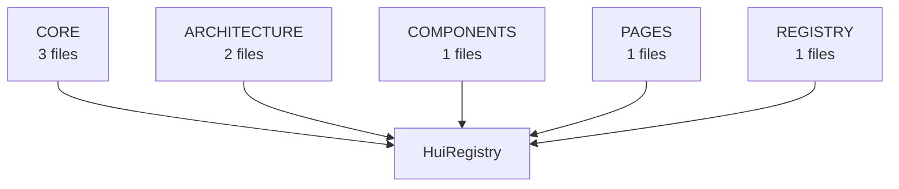

## Violation Graph

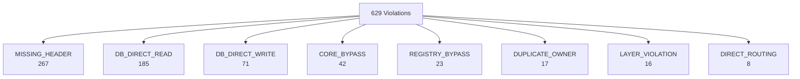

## Migration Graph

```mermaid
graph LR
%% HUI Architecture Knowledge Graph — ARCH-002

  Migration__supabase_migrations_007_media_stories_p["007_media_stories_pipeline.sql"]
  Migration__supabase_migrations_007_media_stories_p --> t_media["media"]
  Migration__supabase_migrations_007_media_stories_p --> t_stories["stories"]
  Migration__supabase_migrations_007_media_stories_p --> t_story_views["story_views"]
  Migration__supabase_migrations_007_media_stories_p --> t_feed_items["feed_items"]
  Migration__supabase_migrations_20260608_block_dele["20260608_block_delete.sql"]
  Migration__supabase_migrations_20260608_block_dele --> t_profiles["profiles"]
  Migration__supabase_migrations_20260609_works_appr["20260609_works_approval_system.sql"]
  Migration__supabase_migrations_20260609_works_appr --> t_works["works"]
  Migration__supabase_migrations_20260609_works_appr --> t_pg_policies["pg_policies"]
  Migration__supabase_migrations_20260611_experience["20260611_experiences_approval_system.sql"]
  Migration__supabase_migrations_20260611_experience --> t_experiences["experiences"]
  Migration__supabase_migrations_20260611_experience --> t_projects["projects"]
  Migration__supabase_migrations_20260611_experience --> t_information_schema["information_schema"]
  Migration__supabase_migrations_20260611_previous_d["20260611_previous_data_snapshot.sql"]
  Migration__supabase_migrations_20260611_previous_d --> t_works["works"]
  Migration__supabase_migrations_20260611_previous_d --> t_experiences["experiences"]
  Migration__supabase_migrations_20260611_previous_d --> t_projects["projects"]
  Migration__supabase_migrations_20260627_052_commer["20260627_052_commerce_p0_security.sql"]
  Migration__supabase_migrations_20260627_052_commer --> t_orders["orders"]
  Migration__supabase_migrations_20260627_052_commer --> t_creator_wallets["creator_wallets"]
  Migration__supabase_migrations_20260627_052_commer --> t_webhook_events["webhook_events"]
  Migration__supabase_migrations_20260627_052_commer --> t_old["old"]
  Migration__supabase_migrations_20260627_052_commer --> t_works["works"]
  Migration__supabase_migrations_20260627_053_cart_h["20260627_053_cart_hash_aborted_status.sql"]
  Migration__supabase_migrations_20260627_053_cart_h --> t_orders["orders"]
  Migration__supabase_migrations_20260627_053_cart_h --> t_order_items["order_items"]
  Migration__supabase_migrations_20260627_054_commer["20260627_054_commerce_infrastructure_sync.sql"]
  Migration__supabase_migrations_20260627_054_commer --> t_orders["orders"]
  Migration__supabase_migrations_20260627_054_commer --> t_order_items["order_items"]
  Migration__supabase_migrations_20260627_054_commer --> t_commerce_events["commerce_events"]
  Migration__supabase_migrations_20260627_054_commer --> t_webhook_events["webhook_events"]
  Migration__supabase_migrations_20260627_054_commer --> t_creator_wallets["creator_wallets"]
  Migration__supabase_migrations_20260627_057_commer["20260627_057_commerce_schema_final.sql"]
  Migration__supabase_migrations_20260627_057_commer --> t_orders["orders"]
  Migration__supabase_migrations_20260627_057_commer --> t_information_schema["information_schema"]
  Migration__supabase_migrations_20260627_057_commer --> t_pg_trigger["pg_trigger"]
  Migration__supabase_migrations_20260627_057_commer --> t_pg_class["pg_class"]
  Migration__supabase_migrations_20260627_057_commer --> t_pg_namespace["pg_namespace"]
  Migration__supabase_migrations_phase1_sql["phase1.sql"]
  Migration__supabase_migrations_phase1_sql --> t_favorites["favorites"]
  Migration__supabase_migrations_phase1_sql --> t_bookings["bookings"]
  Migration__supabase_migrations_phase1_sql --> t_profiles["profiles"]
  Migration__supabase_phase4c_membership_sql["phase4c_membership.sql"]
  Migration__supabase_phase4c_membership_sql --> t_profiles["profiles"]
  Migration__supabase_phase4c_membership_sql --> t_updated_profile["updated_profile"]
  Migration__supabase_phase4d_creator_economy_sql["phase4d_creator_economy.sql"]
  Migration__supabase_phase4d_creator_economy_sql --> t_creator_wallets["creator_wallets"]
  Migration__supabase_phase4d_creator_economy_sql --> t_creator_supports["creator_supports"]
  Migration__supabase_phase4d_creator_economy_sql --> t_experience_bookings["experience_bookings"]
  Migration__supabase_phase4d_creator_economy_sql --> t_works["works"]
  Migration__supabase_phase4d_creator_economy_sql --> t_work_sales["work_sales"]
  Migration__sql_034_membership_type_fix_sql["034_membership_type_fix.sql"]
  Migration__sql_034_membership_type_fix_sql --> t_profiles["profiles"]
  Migration__sql_035_phase3_real_systems_sql["035_phase3_real_systems.sql"]
  Migration__sql_035_phase3_real_systems_sql --> t_information_schema["information_schema"]
  Migration__sql_035_phase3_real_systems_sql --> t_follows["follows"]
  Migration__sql_035_phase3_real_systems_sql --> t_profiles["profiles"]
  Migration__sql_035_phase3_real_systems_sql --> t_experiences["experiences"]
  Migration__sql_035_phase3_real_systems_sql --> t_chats["chats"]
  Migration__sql_036_presence_reactions_sql["036_presence_reactions.sql"]
  Migration__sql_036_presence_reactions_sql --> t_user_presence["user_presence"]
  Migration__sql_036_presence_reactions_sql --> t_story_reactions["story_reactions"]
```

## Domain Graph

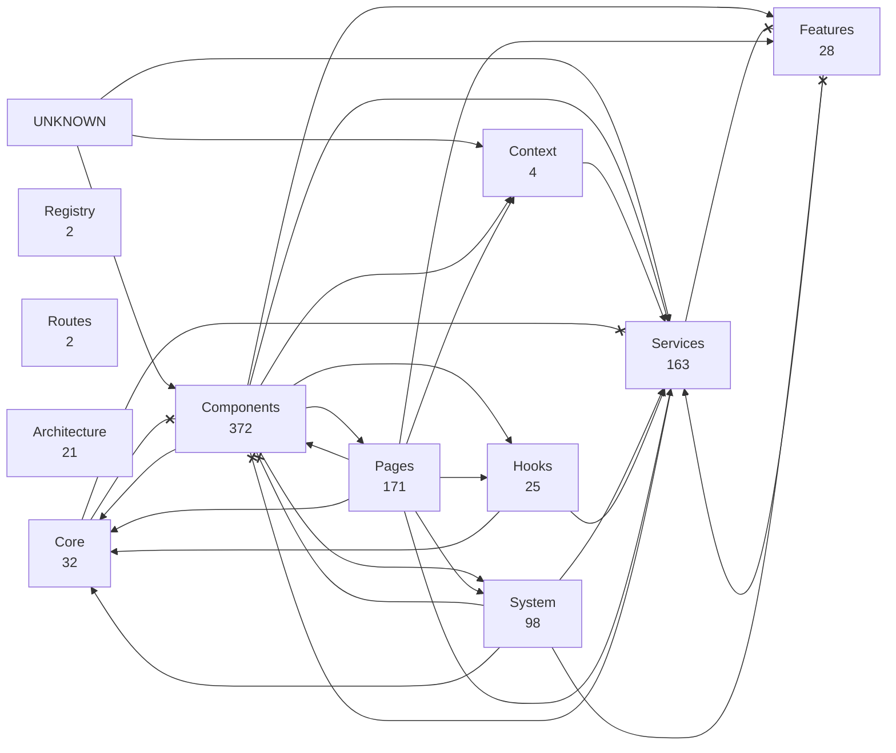

## Feature Graph

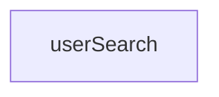
