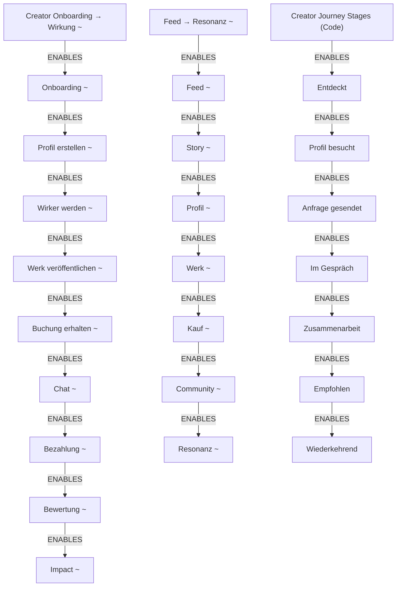
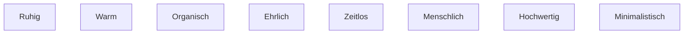
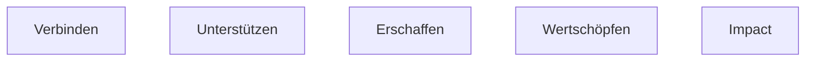
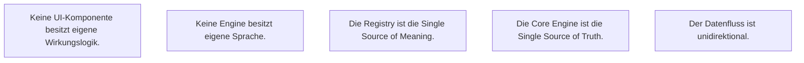
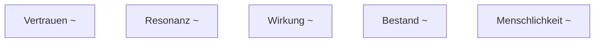

# HUI Semantic Architecture Graphs — ARCH-002.1

> Autogeneriert. `~` = inferred confidence.

## Capability Graph


## Journey Graph



## Meaning Graph

```mermaid
graph TD
  %% Meaning Graph

  intent_connect["connect"]
  intent_message["message"]
  intent_book["book"]
  intent_follow["follow"]
  intent_discover["discover"]
  intent_explore["explore"]
  intent_inspire["inspire"]
  intent_resonate["resonate"]
  intent_share["share"]
  intent_impact["impact"]
  intent_create["create"]
  intent_publish["publish"]
  intent_return["return"]
  intent_orient["orient"]
  meaning_lib_bookingContext_js["Warum bookingContext.js?"]
  meaning_registry_HuiRegistry_js["Warum HuiRegistry.js?"]
  meaning_core_hui_semantics_js["Warum hui.semantics.js?"]
  meaning_core_hui_actions_js["Warum hui.actions.js?"]
  meaning_routes_registry_js["Warum registry.js?"]
  meaning_lib_journeyContext_js["Warum journeyContext.js?"]

```



## Constitution Graph

```mermaid
graph TD
  %% Constitution Graph

  constitution_rule_1["Regel 1: Menschen sind keine Produkte."]
  constitution_rule_2["Regel 2: Wirkung ist wichtiger als Aufmerksamkeit."]
  constitution_rule_3["Regel 3: Verbinden ist wertvoller als Reichweite."]
  constitution_rule_4["Regel 4: Wertschöpfung und Gemeinwohl gehören zusammen."]
  constitution_rule_5["Regel 5: Der Orb zeigt keine Leistung. Er zeigt gelebte Wirkung."]
  constitution_rule_6["Regel 6: Der Feed dient Orientierung. Nicht Sucht."]
  constitution_rule_7["Regel 7: Die KI ergänzt Menschen. Sie ersetzt sie nicht."]
  constitution_rule_8["Regel 8: Keine Gamification. Keine Belohnungssysteme."]
  constitution_rule_9["Regel 9: Jede neue Funktion muss mindestens einen Grundpfeiler stärken."]
  constitution_rule_10["Regel 10: Kurzfristiges Wachstum darf die Gemeinschaft nicht schädigen."]
  invariant_unidirectional_dataflow["Unidirektionaler Datenfluss"]
  invariant_no_ui_impact_logic["Keine UI-Wirkungslogik"]
  invariant_registry_single_meaning["Registry ist Single Source of Meaning"]
  mission_hui["HUI Mission"]

  constitution_rule_1 -->|DERIVED_FROM| mission_hui
  constitution_rule_2 -->|DERIVED_FROM| mission_hui
  constitution_rule_3 -->|DERIVED_FROM| mission_hui
  constitution_rule_4 -->|DERIVED_FROM| mission_hui
  constitution_rule_5 -->|DERIVED_FROM| mission_hui
  constitution_rule_6 -->|DERIVED_FROM| mission_hui
  constitution_rule_7 -->|DERIVED_FROM| mission_hui
  constitution_rule_8 -->|DERIVED_FROM| mission_hui
  constitution_rule_9 -->|DERIVED_FROM| mission_hui
  constitution_rule_10 -->|DERIVED_FROM| mission_hui
```



## Human Principle Graph



## Platform Goal Graph



## Feature Intent Graph

```mermaid
graph TD
  %% Feature Intent Graph


```

## Architecture Principle Graph



## Quality Attribute Graph



## Semantic Dependency Graph

```mermaid
graph TD
  %% Semantic Dependency Graph

  capability_identity["Identity"]
  capability_discovery["Discovery"]
  capability_feed["Feed"]
  capability_stories["Stories"]
  capability_works["Works"]
  capability_experiences["Experiences"]
  capability_messaging["Messaging"]
  capability_booking["Booking"]
  capability_payments["Payments"]
  capability_commerce["Commerce"]
  capability_impact["Impact"]
  capability_trust["Trust"]
  capability_orb["Orb"]
  capability_presence["Presence"]
  capability_community["Community"]
  file_lib_ErrorBoundaries_jsx["ErrorBoundaries.jsx"]
  file_lib_AuthContext_jsx["AuthContext.jsx"]
  file_context_WorldSurfaceContext_jsx["WorldSurfaceContext.jsx"]
  file_context_OrbWorldContext_jsx["OrbWorldContext.jsx"]
  file_pages_LoginPage_jsx["LoginPage.jsx"]
  file_components_auth_AuthGate_jsx["AuthGate.jsx"]
  file_components_auth_ProfileCompletionFlow_jsx["ProfileCompletionFlow.jsx"]
  file_pages_AuthCallback_jsx["AuthCallback.jsx"]
  file_lib_referralTracking_js["referralTracking.js"]
  file_pages_ImpactPage_jsx["ImpactPage.jsx"]
  file_architecture_scanner_metricsCalculator_js["metricsCalculator.js"]
  file_architecture_semantic_reportGenerator_js["reportGenerator.js"]
  file_architecture_scanner_reportGenerator_js["reportGenerator.js"]
  file_components_CreatorPresence_jsx["CreatorPresence.jsx"]
  file_lib_intelligence_emotionalIdentity_js["emotionalIdentity.js"]

  file_components_CreatorPresence_jsx -->|REALIZES| capability_presence
  file_components_auth_AuthGate_jsx -->|REALIZES| capability_identity
  file_components_auth_ProfileCompletionFlow_jsx -->|REALIZES| capability_identity
  file_context_OrbWorldContext_jsx -->|REALIZES| capability_orb
  file_context_OrbWorldContext_jsx -->|REALIZES| capability_presence
  file_context_WorldSurfaceContext_jsx -->|REALIZES| capability_presence
  file_lib_AuthContext_jsx -->|REALIZES| capability_identity
  file_lib_ErrorBoundaries_jsx -->|REALIZES| capability_orb
  file_lib_intelligence_emotionalIdentity_js -->|REALIZES| capability_identity
  file_pages_AuthCallback_jsx -->|REALIZES| capability_identity
  file_pages_ImpactPage_jsx -->|REALIZES| capability_impact
  file_pages_LoginPage_jsx -->|REALIZES| capability_identity
  file_lib_AuthContext_jsx -->|IMPLEMENTS| capability_identity
  file_lib_ErrorBoundaries_jsx -->|IMPLEMENTS| capability_orb
  file_lib_intelligence_emotionalIdentity_js -->|IMPLEMENTS| capability_identity
```


